# Glossar – Bluetooth Low Energy Fundamentals

Begriffe, Abkürzungen und Spezifikationswerte aus dem Kurs
**"Bluetooth Low Energy Fundamentals"** der Nordic Developer Academy
(Lektionen 1–6, Theorie-Themen; Übungen ausgeklammert).

Stand: August 2026 · Quelle: https://academy.nordicsemi.com/courses/bluetooth-low-energy-fundamentals/

> **Hinweis zu den Abbildungen:** Die Grafiken liegen als PNG im Unterordner `bilder/`
> und sind relativ verlinkt. Damit sie angezeigt werden, muss dieser Ordner neben der
> `.md`-Datei liegen. Ein Diagramm (GAP- gegenüber GATT-Rollen) ist als Mermaid-Codeblock
> eingebettet und wird von GitHub, VS Code, Obsidian und Typora direkt gerendert.

---

## Inhaltsverzeichnis

1. [Grundlagen und Protokollstack](#1-grundlagen-und-protokollstack)
2. [GAP – Rollen und Topologien](#2-gap--rollen-und-topologien)
3. [PHY – Funkmodi und Kanäle](#3-phy--funkmodi-und-kanäle)
4. [Advertising](#4-advertising)
5. [Bluetooth-Adressen](#5-bluetooth-adressen)
6. [Verbindungen (Connections)](#6-verbindungen-connections)
7. [Verbindungsparameter](#7-verbindungsparameter)
8. [ATT / GATT – Datenaustausch](#8-att--gatt--datenaustausch)
9. [Attribute, Services und Characteristics](#9-attribute-services-und-characteristics)
10. [Sicherheit: Pairing, Bonding, Verschlüsselung](#10-sicherheit-pairing-bonding-verschlüsselung)
11. [Security Modes und Levels](#11-security-modes-und-levels)
12. [Sniffing und Debugging](#12-sniffing-und-debugging)
13. [Kennzahlen-Übersicht](#13-kennzahlen-übersicht)
14. [Abkürzungsverzeichnis](#14-abkürzungsverzeichnis)

---

## 1. Grundlagen und Protokollstack

**Bluetooth Low Energy (Bluetooth LE, BLE)**
Funkstandard, eingeführt mit der Bluetooth Core Specification **4.0**. Optimiert auf minimalen Energieverbrauch statt auf hohe Datenrate – dadurch Schlüsseltechnologie für batteriebetriebene IoT-Anwendungen. Der niedrige Verbrauch entsteht vor allem durch (a) kleine Datenpakete (27–251 Byte Nutzlast) und (b) seltenes Senden, weil lange Funk-Einschaltzeiten der dominierende Stromverbraucher sind.

**Bluetooth Classic (BR/EDR)**
Vorgängertechnologie, ausgelegt auf hohen Durchsatz (z. B. Audio-Streaming). Für batteriebeschränkte Geräte ungeeignet. BLE und Classic sind eigenständige, nicht kompatible Funkverfahren; die meisten Smartphones beherrschen beide.

**Bluetooth SIG (Special Interest Group)**
Gremium, das die Bluetooth Core Specification pflegt, offizielle GATT-Profile definiert und 16-Bit-UUIDs vergibt.

**Core Specification**
Normdokument des Bluetooth SIG. Versionsmeilensteine im Kurs: 4.0 (BLE-Einführung), 4.2 (LE Secure Connections, Data Length Extension), 5.0 (2M PHY, Coded PHY), 5.4 (PAwR), 6.2 (Passkey Entry nicht mehr für Security Level 3 ausreichend).

**Protokollstack**
Schichtmodell von BLE, zweigeteilt in **Host** (obere Schichten) und **Controller** (untere Schichten), dazwischen das **HCI** als Schnittstelle. Im Host stehen zwei Zweige nebeneinander: **GATT** über **ATT** auf der Datenseite, **GAP** und **SMP** auf der Verbindungs- und Sicherheitsseite. **L2CAP** bündelt sie. GAP reicht darüber hinaus bis an die Unterkante des Host — es ist nicht auf L2CAP angewiesen.

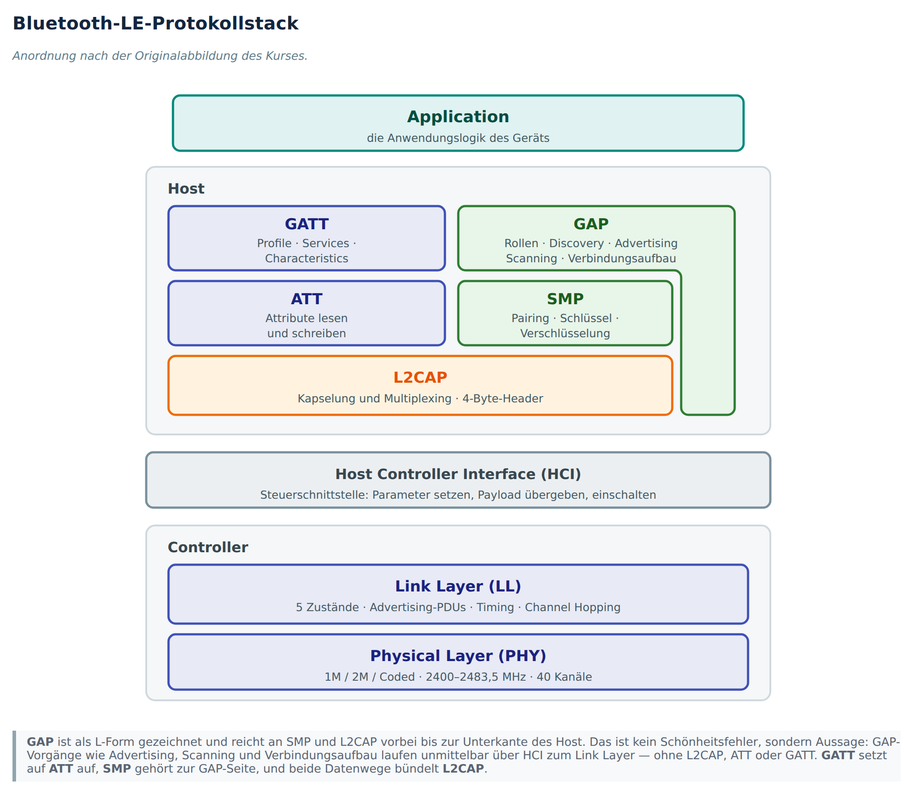

*Abb.: Bluetooth-LE-Protokollstack: Host, Controller und HCI*

**Host**
Oberer Teil des Stacks: GAP, GATT, ATT, SMP, L2CAP. Im Nordic-Umfeld implementiert durch den **Zephyr Bluetooth Host**, der die Anwendungs-APIs bereitstellt.

**Controller**
Unterer Teil des Stacks: Link Layer und PHY. Nordics Implementierung ist der **SoftDevice Controller** für die Serien nRF52, nRF53 und nRF54.

**HCI (Host Controller Interface)**
Standardisierte Schnittstelle zwischen Host und Controller, über die beide Teile Kommandos und Ereignisse austauschen.

**GAP (Generic Access Profile)**
Schicht direkt an der Anwendung; regelt Geräte-Sichtbarkeit, Auffindbarkeit (Discovery), Rollen und alles rund um den Verbindungsaufbau. In der Stack-Abbildung als L-Form dargestellt, weil GAP-Vorgänge wie Advertising und Scanning ohne L2CAP unmittelbar bis zum Link Layer reichen.

**GATT (Generic Attribute Profile)**
Definiert die Verfahren zur Nutzung der ATT-Schicht und die hierarchische Ordnung der Daten in Profile → Services → Characteristics.

**ATT (Attribute Protocol)**
Protokoll, mit dem ein Gerät bestimmte Daten (Attribute) gegenüber einem anderen Gerät sichtbar macht. Arbeitet nach dem Client-Server-Prinzip. Liegt im Stack unter GATT.

**SMP (Security Manager Protocol)**
Schicht für Pairing, Schlüsselerzeugung und -verteilung sowie Verschlüsselung. Liegt im Stack unter GAP.

**L2CAP (Logical Link Control and Adaptation Protocol)**
Multiplex- und Kapselungsschicht; bündelt die Datenwege der darüberliegenden Schichten und verpackt sie für den Link Layer. Header-Größe: **4 Byte**. Beim Advertising ist L2CAP nicht beteiligt.

**Link Layer (LL)**
Steuert den Zustand des Funkteils. Fünf Zustände: **Standby, Advertising, Scanning, Initiating, Connection**. Verantwortlich für Kanalwechsel, Timing, Quittierung und Wiederholungen.

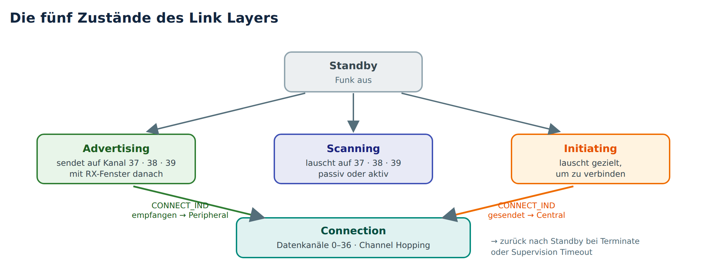

*Abb.: Die fünf Zustände des Link Layers*

**PHY (Physical Layer)**
Physikalische Schicht: wie Daten auf die Funkwelle moduliert, gesendet und empfangen werden.

---

## 2. GAP – Rollen und Topologien

**Central (Zentrale)**
Rolle, die scannt und Verbindungen zu Peripherals initiiert. Kann mehrere Peripherals gleichzeitig verbinden, übernimmt Verbindungsverwaltung und Datenverarbeitung. Höherer Ressourcen- und Stromverbrauch (typisch: Smartphone, Gateway).

**Peripheral**
Rolle, die Advertising-Pakete sendet und Verbindungsanfragen von Centrals annimmt. Typischerweise ressourcen- und energiebeschränktes IoT-Gerät (Sensor, Wearable).

**Broadcaster**
Sonderform des Peripherals: sendet ausschließlich Advertising-Pakete und akzeptiert keine Verbindungsanfragen. Typisch für Beacons.

**Observer**
Sonderform der Central: hört nur Advertising-Pakete mit, ohne eine Verbindung aufzubauen.

**Advertising**
Vorgang des Sendens von Advertising-Paketen – entweder zum reinen Verteilen von Daten oder um von anderen Geräten gefunden zu werden.

**Scanning**
Vorgang des Lauschens auf Advertising-Pakete.

**Verbindungsorientierte Kommunikation (Connection-oriented)**
Dedizierte, bidirektionale Verbindung zwischen zwei Geräten.

**Broadcast-Kommunikation (Connectionless)**
Kommunikation ohne Verbindungsaufbau durch Aussenden von Advertising-Paketen.

**Broadcast-Topologie**
Ein Sender, beliebig viele Empfänger. Vorteile: unbegrenzte Empfängerzahl, energieeffizient. Nachteile: sehr begrenzte Datenmenge pro Paket, keine Quittierung (Acknowledgement), keine Rückkanal-Sicherheit.

**Connected-Topologie**
Verbindung vor Datenübertragung. Vorteile: bidirektional, höherer Durchsatz, Quittierung. Begrenzt durch Bandbreite und Hardware-Ressourcen (maximale Anzahl gleichzeitiger Verbindungen).

**Multi-Role-Topologie**
Ein Gerät nimmt gleichzeitig mehrere Rollen ein (z. B. Peripheral und Central zugleich). Grundlage für Hub-/Gateway-Architekturen, die Sensordaten sammeln und weiterreichen.

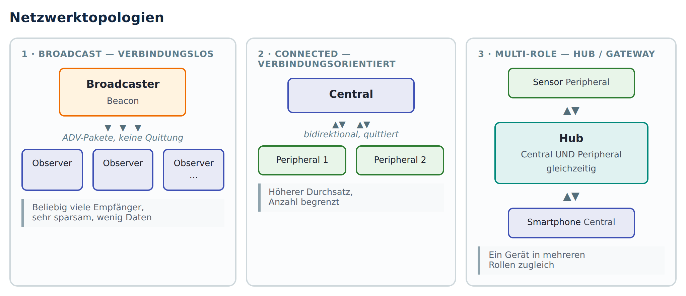

*Abb.: Die drei Netzwerktopologien: Broadcast, Connected, Multi-Role*

| | Broadcast | Connected |
|---|---|---|
| Empfänger | unbegrenzt viele | begrenzt (Bandbreite/Hardware) |
| Richtung | nur Sender → Empfänger | bidirektional |
| Quittierung | nein | ja |
| Datenmenge | sehr begrenzt (ADV-Paket) | hoch |
| Stromverbrauch | sehr gering | höher |

**PAwR (Periodic Advertising with Responses)**
Mit Bluetooth **5.4** eingeführt; ermöglicht bidirektionale Kommunikation im verbindungslosen Modus.

---

## 3. PHY – Funkmodi und Kanäle

**ISM-Band 2,4 GHz**
Betriebsfrequenzbereich von BLE: **2400–2483,5 MHz**, aufgeteilt in **40 HF-Kanäle** à **2 MHz** Kanalbandbreite.

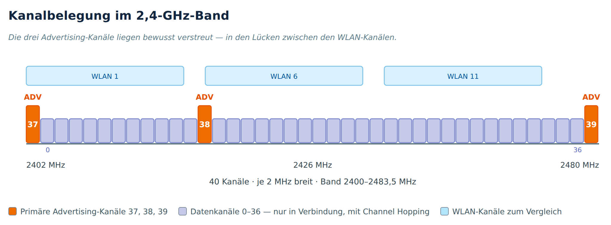

*Abb.: Kanalbelegung im 2,4-GHz-Band*

**1M PHY**
Klassischer PHY, den **alle** BLE-Geräte unterstützen. Datenrate **1 Mbit/s**. Standard beim Verbindungsaufbau; danach kann bei beidseitiger Unterstützung gewechselt werden.

**2M PHY**
Eingeführt mit Bluetooth **5.0**. Datenrate **2 Mbit/s** – doppelter Durchsatz. Vorteil: kürzere Sendezeiten, dadurch geringerer Energieverbrauch pro übertragenem Byte. Nachteil: geringere Empfängerempfindlichkeit und damit kürzere Reichweite.

**Coded PHY**
Eingeführt mit Bluetooth **5.0** für erhöhte Reichweite auf Kosten des Durchsatzes. Verwendet Vorwärtsfehlerkorrektur: ein Bit wird durch mehrere Symbole dargestellt.

| Modus | Symbole pro Bit | Datenrate |
|-------|-----------------|-----------|
| S = 2 | 2 | 500 kbit/s |
| S = 8 | 8 | 125 kbit/s |

**Sendeleistung**
Maximal **20 dBm** (0,1 W) laut Spezifikation.

**Reichweite**
Bis zu ca. **1000 m** bei 125 kbit/s und 500 kbit/s (Coded PHY, Sichtverbindung).

**Anwendungsdurchsatz**
Maximal ca. **1,4 Mbit/s** auf Anwendungsebene (bei 2M PHY, nach Abzug des Protokoll-Overheads).

**Grundregel PHY-Wahl**
Höhere Datenrate → kürzere Funkzeit, aber geringere Reichweite. Kodierung → mehr Reichweite, aber weniger Durchsatz.

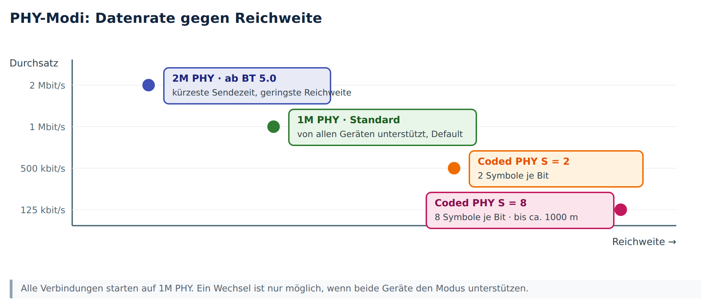

*Abb.: PHY-Modi: Datenrate gegen Reichweite*

---

## 4. Advertising

### Advertising im Protokollstack

Advertising ist im Kern eine **Controller-Angelegenheit**: Link Layer und PHY machen die eigentliche Arbeit, der Host steuert nur über HCI und liefert den Inhalt.

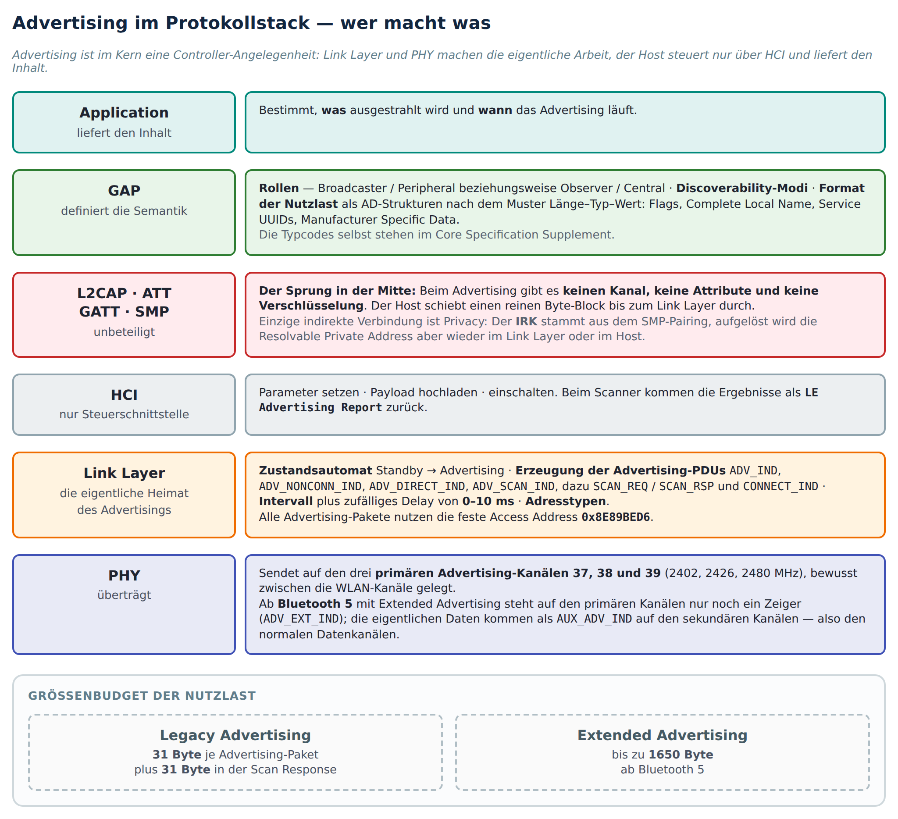

*Abb.: Advertising im Protokollstack — welche Schicht was beiträgt*

**Link Layer – die eigentliche Heimat des Advertisings**
Dort läuft der Zustandsautomat (Standby → Advertising), dort entstehen die Advertising-PDUs (`ADV_IND`, `ADV_NONCONN_IND`, `ADV_DIRECT_IND`, `ADV_SCAN_IND`, dazu `SCAN_REQ`/`SCAN_RSP` und `CONNECT_IND`), und dort werden Intervall plus das zufällige Delay von **0–10 ms** sowie die Adresstypen verwaltet. Alle Advertising-Pakete nutzen die feste Access Address **`0x8E89BED6`**.

**PHY – überträgt**
Sendet auf den drei primären Advertising-Kanälen **37, 38 und 39** (2402, 2426, 2480 MHz), die bewusst zwischen die WLAN-Kanäle gelegt wurden. Ab **Bluetooth 5** mit Extended Advertising steht auf den primären Kanälen nur noch ein Zeiger (`ADV_EXT_IND`); die eigentlichen Daten kommen als `AUX_ADV_IND` auf den sekundären Kanälen, also den normalen Datenkanälen.

**HCI – nur die Steuerschnittstelle**
Zwischen Host und Controller: Parameter setzen, Payload hochladen, einschalten. Beim Scanner kommen die Ergebnisse als `LE Advertising Report` zurück.

**GAP – definiert die Semantik**
Rollen (Broadcaster/Peripheral beziehungsweise Observer/Central), Discoverability-Modi und das Format der Nutzlast als AD-Strukturen nach dem Muster **Länge–Typ–Wert** (Flags, Complete Local Name, Service UUIDs, Manufacturer Specific Data). Die Typcodes selbst stehen im **Core Specification Supplement**.

**Der Sprung in der Mitte: L2CAP, ATT, GATT und SMP sind unbeteiligt**
Es gibt beim Advertising keinen Kanal, keine Attribute und keine Verschlüsselung – der Host schiebt einen reinen Byte-Block bis zum Link Layer durch. Die einzige indirekte Verbindung ist **Privacy**: Der IRK stammt aus dem SMP-Pairing, aufgelöst wird die Resolvable Private Address aber wieder im Link Layer (oder im Host).

**Größenbudget der Nutzlast**

| Variante | Nutzlast |
|----------|----------|
| Legacy Advertising | **31 Byte** je Advertising-Paket, plus **31 Byte** in der Scan Response |
| Extended Advertising (ab Bluetooth 5) | bis zu **1650 Byte** |

---

**Advertising-Paket**
Vom Advertiser ausgesendetes Paket zur Bekanntgabe der eigenen Existenz und/oder von Daten.

**Advertising Interval**
Zeitabstand zwischen zwei Advertising-Ereignissen. Bereich **20 ms bis 10,24 s**, Schrittweite **0,625 ms**. Kürzeres Intervall → schnellere Auffindbarkeit, aber höherer Stromverbrauch.

**Random Delay (Advertising Delay)**
Zufällige Verzögerung von **0–10 ms**, die vor jedem Advertising-Paket hinzugefügt wird, damit Geräte mit identischem Intervall nicht dauerhaft kollidieren.

**Primäre Advertising-Kanäle**
Die drei Kanäle **37, 38 und 39**. Sie liegen im Frequenzband bewusst nicht nebeneinander, um Störungen (u. a. durch WLAN) zu minimieren. Ein Advertising-Paket wird redundant auf allen drei Kanälen gesendet.

**Scan Interval**
Zeitabstand, in dem ein Gerät nach Advertising-Paketen sucht. Bereich **2,5 ms bis 10,24 s**, Schrittweite **0,625 ms**.

**Scan Window**
Dauer, die innerhalb eines Scan Interval tatsächlich gelauscht wird. Gleicher Bereich und gleiche Schrittweite wie das Scan Interval. Das Verhältnis Scan Window / Scan Interval ergibt den Tastgrad (Duty Cycle) des Scannens; Window = Interval bedeutet kontinuierliches Scannen.

**Scan Request (SCAN_REQ)**
Anfrage einer Central an einen Advertiser mit der Bitte um zusätzliche Informationen.

**Scan Response (SCAN_RSP)**
Antwort des Advertisers auf einen Scan Request mit zusätzlichen Daten; wird ebenfalls auf den drei primären Kanälen gesendet. Darf auch leer sein.

**Passives / aktives Scannen**
Passiv: nur Mithören. Aktiv: der Scanner sendet zusätzlich Scan Requests, um Scan-Response-Daten zu erhalten.

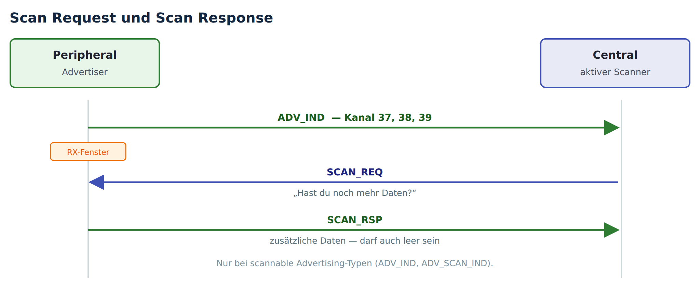

*Abb.: Scan Request und Scan Response zwischen Central und Peripheral*

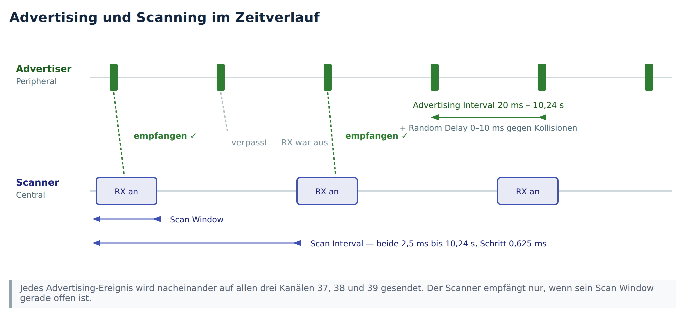

*Abb.: Advertising und Scanning im Zeitverlauf*

### Advertising-Typen (Legacy)

Klassifiziert nach drei Eigenschaftspaaren:
* **Connectable / Non-connectable** – ob eine Verbindung aufgebaut werden darf
* **Scannable / Non-scannable** – ob Scan Requests beantwortet werden
* **Directed / Undirected** – ob gezielt an einen bestimmten Empfänger oder allgemein gesendet wird

| Typ | Connectable | Scannable | Directed | Einsatz |
|-----|:-----------:|:---------:|:--------:|---------|
| **ADV_IND** | ✓ | ✓ | – | Häufigster Typ: allgemeines, verbindbares Advertising |
| **ADV_DIRECT_IND** | ✓ | – | ✓ | Schneller Wiederverbindungsaufbau zu einem bekannten Peer (z. B. BT-Maus zum PC) |
| **ADV_SCAN_IND** | – | ✓ | – | Beacon mit zusätzlichen Scan-Response-Daten, keine Verbindung |
| **ADV_NONCONN_IND** | – | – | – | Reiner Beacon; minimaler Verbrauch, da der Empfänger nie aktiviert wird |

*Auswahlhilfe — welcher Advertising-Typ passt?*

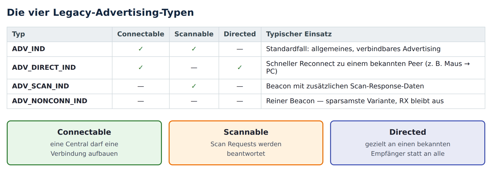

*Abb.: Die vier Legacy-Advertising-Typen im Vergleich*

### Paketaufbau

**PDU (Protocol Data Unit)**
Nutzdateneinheit eines BLE-Pakets. Man unterscheidet **Advertising PDU** (Advertising-Kanal) und **Data PDU** (Datenkanal).

**Advertising-PDU-Header** – Felder:
* **PDU Type** – Advertising-Typ (z. B. ADV_IND)
* **RFU** – Reserved for Future Use (reserviert)
* **ChSel** – 1, wenn LE Channel Selection Algorithm #2 unterstützt wird
* **TxAdd** – 0/1: Adresstyp des Senders (public/random)
* **RxAdd** – 0/1: Adresstyp des Empfängers (public/random)
* **Length** – Größe der Payload in Byte

**Advertising-PDU-Payload**
* **AdvA** – **6 Byte**, Bluetooth-Adresse des Advertisers
* **AdvData** – die eigentlichen Advertising-Daten (AD-Strukturen)
* Sonderfall **ADV_DIRECT_IND**: statt AdvData steht dort ein **6 Byte** großes Empfängeradressfeld; es gibt keine Nutzdaten.

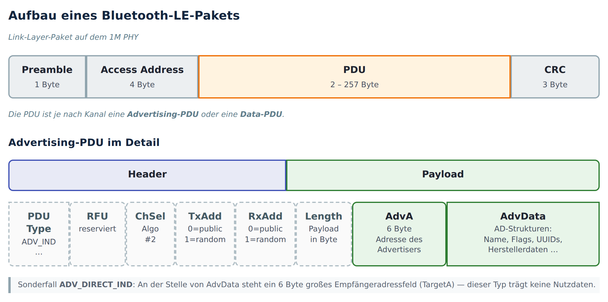

*Abb.: Aufbau eines Bluetooth-LE-Pakets und der Advertising-PDU*

**AD-Struktur (Advertising Data Structure)**
Baustein der Advertising-Daten, bestehend aus:
* **Length** – Länge der AD-Struktur
* **AD Type** – Datentyp, üblicherweise **1 Byte**
* **AD Data** – die eigentlichen Daten

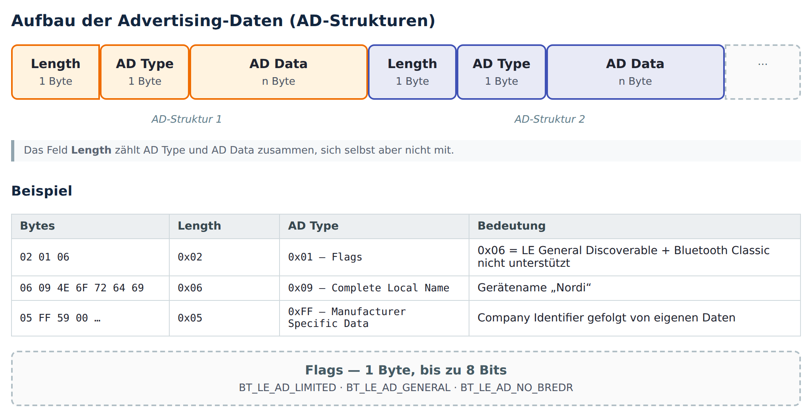

*Abb.: Aufbau der Advertising-Daten (AD-Strukturen)*

**Gängige AD-Typen** (Zephyr-Bezeichner)
* `BT_DATA_NAME_COMPLETE` – vollständiger Gerätename
* `BT_DATA_NAME_SHORTENED` – gekürzter Gerätename
* `BT_DATA_URI` – Uniform Resource Identifier
* Service-UUID
* `BT_DATA_MANUFACTURER_DATA` – **Manufacturer Specific Data**; erlaubt Herstellern eigene Advertising-Daten (beginnt mit der Company Identifier des SIG)
* **Flags** – 1 Byte mit bis zu 8 Einzelbit-Flags

**Flags (1 Byte)**
* `BT_LE_AD_LIMITED` – LE Limited Discoverable Mode (zeitlich begrenzt sichtbar)
* `BT_LE_AD_GENERAL` – LE General Discoverable Mode (dauerhaft sichtbar)
* `BT_LE_AD_NO_BREDR` – Bluetooth Classic (BR/EDR) wird nicht unterstützt

---

## 5. Bluetooth-Adressen

**Bluetooth-Adresse**
**48 Bit** (6 Byte) langer Bezeichner eines Geräts. Grundunterscheidung: **Public** oder **Random**; Random teilt sich in **Static** und **Private**, Private wiederum in **Resolvable** und **Non-Resolvable**.

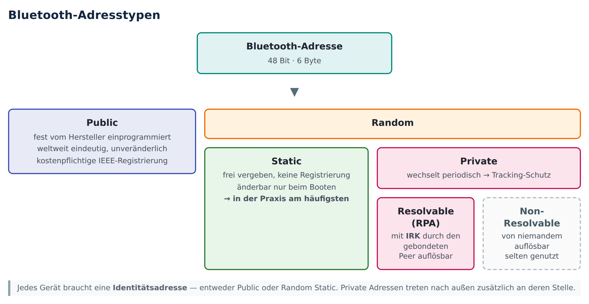

*Abb.: Die Bluetooth-Adresstypen im Überblick*

> **Merksatz:** Jedes Gerät braucht eine **Identitätsadresse** – entweder Public oder Random Static.
> Private Adressen treten nach außen zusätzlich an deren Stelle.

**Public Address**
Feste, beim Hersteller einprogrammierte Adresse. Weltweit eindeutig, über die gesamte Lebensdauer unveränderlich. Erfordert eine kostenpflichtige Registrierung bei der IEEE. Auch "Bluetooth-MAC-Adresse" genannt.

**Random Static Address**
Frei vergebene, fest zugewiesene Adresse. Darf beim Bootvorgang geändert werden, **nicht** zur Laufzeit. Keine IEEE-Registrierung nötig – deshalb die kostengünstige und **weitaus häufigere** Variante bei BLE-Geräten.

**Resolvable Random Private Address (RPA)**
Wechselt periodisch, um die Identität des Geräts zu verbergen und Tracking zu erschweren. Ein vorab ausgetauschter **IRK** erlaubt dem gebondeten Peer, die wechselnde Adresse jedes Mal aufzulösen und dem echten Gerät zuzuordnen.

**Non-Resolvable Random Private Address**
Wechselnde Adresse, die von niemandem auflösbar ist. Dient ausschließlich der Tracking-Vermeidung; in der Praxis selten eingesetzt.

**IRK (Identity Resolving Key)**
Vorab geteilter Schlüssel, mit dem eine Resolvable Private Address in die echte Identitätsadresse des Geräts übersetzt werden kann.

**Pflicht**
Jedes BLE-Gerät muss entweder eine Public Address oder eine Random Static Address besitzen (Identitätsadresse); Private Addresses treten zusätzlich an deren Stelle nach außen.

---

## 6. Verbindungen (Connections)

**Initiator**
Rolle der Central beim Verbindungsaufbau: scannt und sendet nach passendem Advertising-Paket eine Verbindungsanfrage.

**Connection Request (CONNECT_IND)**
Paket der Central an den Advertiser, das u. a. die initialen Verbindungsparameter (Connection Interval usw.) enthält. Diese werden von der Central vorgegeben.

**RX-Fenster nach dem Advertising**
Ein Peripheral, das verbindbar advertised, öffnet nach **jedem** Advertising-Paket ein kurzes Empfangsfenster, um Connection Requests entgegenzunehmen.

**Verbindungsaufbau**
Sendet die Central einen Connection Request und empfängt das Peripheral ihn, sind beide Geräte verbunden. Das Peripheral akzeptiert automatisch – außer es verwendet eine Filter Accept List.

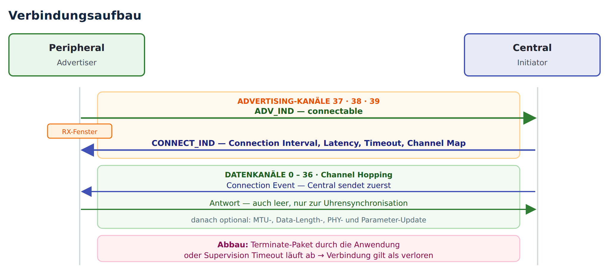

*Abb.: Verbindungsaufbau vom Advertising bis zum Verbindungsabbau*

**Filter Accept List** (früher *Whitelist*)
Eine im **Link Layer** geführte Liste von Geräteadressen, mit der ein Gerät festlegt, wessen Pakete es überhaupt beachtet. Alles, was nicht auf der Liste steht, wird schon im Controller verworfen – der Host bekommt es gar nicht erst zu sehen.

Sie wirkt in drei Situationen, jeweils getrennt einschaltbar:

| Rolle | Wirkung, wenn die Liste aktiv ist |
|-------|-----------------------------------|
| **Advertising** | Nur gelistete Geräte dürfen Scan Requests stellen und/oder eine Verbindung aufbauen |
| **Scanning** | Nur Advertising-Pakete gelisteter Geräte werden an den Host gemeldet |
| **Initiating** | Es wird nur zu gelisteten Geräten eine Verbindung aufgebaut |

Die Einträge stammen typischerweise aus dem **Bonding**: Nach dem Pairing kennt das Gerät seinen Peer und trägt ihn ein. Deshalb behandelt der Kurs beides gemeinsam.

Zwei Punkte, die in der Praxis leicht zu Fehlern führen:

* **Private Adressen:** Ein Peer mit wechselnder Resolvable Private Address steht nicht mit dieser Adresse auf der Liste. Er muss zuerst über seinen **IRK** aufgelöst werden (Resolving List) – erst danach greift die Filterung. Ohne das würde ein gebondetes Gerät ausgesperrt.
* **Kein Sicherheitsmerkmal:** Adressen lassen sich fälschen. Die Liste dient dem **Stromsparen** und dem Vermeiden ungewollter Verbindungen, nicht der Absicherung. Sicherheit entsteht erst durch Pairing und Verschlüsselung.

**Datenkanäle**
Nach dem Verbindungsaufbau wechseln die Geräte von den Advertising-Kanälen (37, 38, 39) auf die **37 Datenkanäle (0–36)**.

**Channel Hopping (Frequenzsprungverfahren)**
Der für die Datenübertragung genutzte Kanal wird häufig gewechselt. Reduziert Störungen und verbessert Durchsatz und Robustheit.

**Channel Map / Channel Map Update**
Liste der aktuell nutzbaren Datenkanäle. Über ein Channel Map Update können gestörte Kanäle ausgeblendet werden (adaptives Frequenzsprungverfahren).

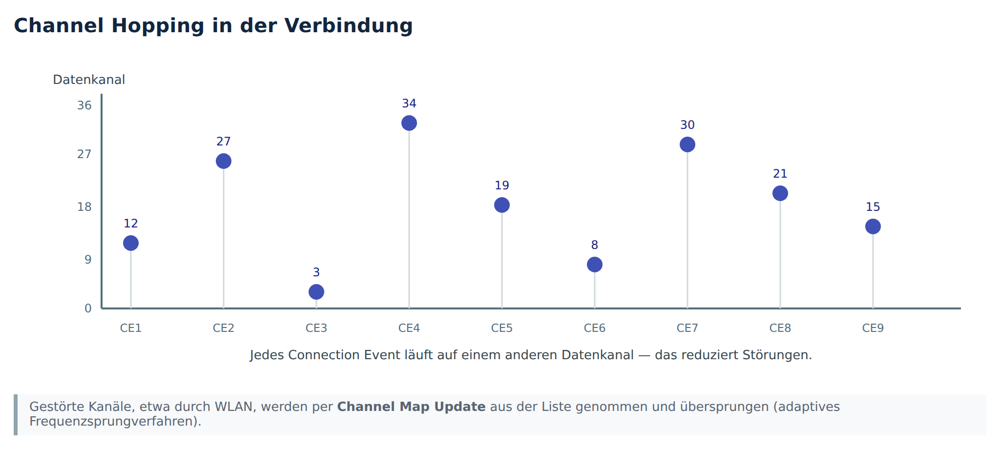

*Abb.: Channel Hopping in der Verbindung*

**Connection Event**
Findet in jedem Connection Interval statt: die Central sendet ein Paket an das Peripheral, das Peripheral antwortet. Beide Geräte wachen synchron auf und schlafen danach wieder. **Auch ohne Nutzdaten** werden leere Pakete ausgetauscht, um die Uhren zu synchronisieren und die Verbindung zu halten.

**Acknowledgement / Retransmission**
Alle über BLE gesendeten Pakete werden auf Link-Layer-Ebene **unbegrenzt wiederholt**, bis eine Quittierung eintrifft oder die Verbindung abbricht.

**Verbindungsabbau**
Zwei Wege: (1) die Anwendung terminiert die Verbindung aktiv per Terminate-Paket; (2) **Supervision Timeout** – ein Gerät antwortet über den konfigurierten Zeitraum hinweg nicht mehr.

---

## 7. Verbindungsparameter

**Connection Interval**
Zeitabstand, in dem sich die verbundenen Geräte aufwecken und Daten austauschen. Danach schalten sie den Funk ab, setzen einen Timer und gehen in den Ruhezustand. Kurzes Intervall → geringe Latenz, hoher Durchsatz, hoher Verbrauch; langes Intervall → umgekehrt.
*(Core-Spec-Bereich: 7,5 ms bis 4 s, Schrittweite 1,25 ms.)*

**Peripheral Latency (früher Slave Latency)**
Anzahl der Connection Events, die das Peripheral überspringen darf, wenn es keine Daten zu senden hat. Erlaubt es, im Normalfall Strom zu sparen und trotzdem bei Bedarf schnell zu reagieren – ohne das Connection Interval zu verlängern.

**Supervision Timeout**
Zeitspanne seit dem letzten erfolgreich empfangenen Paket, nach deren Ablauf die Verbindung als verloren gilt. Reine Ausfallerkennung, kein Scheduling-Parameter. Muss stets größer sein als die durch Latency verlängerte effektive Sendepause.

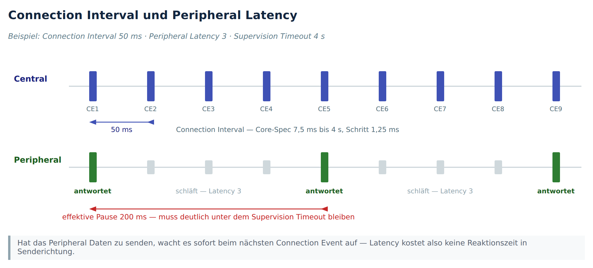

*Abb.: Connection Interval und Peripheral Latency*

**Aushandlung der Parameter**
Connection Interval, Supervision Timeout und Peripheral Latency werden **von der Central vorgegeben**. Das Peripheral kann eine Änderung anfordern (Connection Parameter Update Request), doch die Central entscheidet endgültig.

**Aushandlung von PHY, Data Length und MTU**
Hier darf **jedes** der beiden Geräte eine Aktualisierung anfordern. Das Gegenüber antwortet mit seinen unterstützten Werten oder meldet, dass es die Aktualisierung nicht unterstützt.

**MTU (Maximum Transmission Unit) / ATT_MTU**
Größte Datenmenge, die in einem ATT-Paket übertragen werden kann. Standardwert **23 Byte**. Über den MTU-Exchange erhöhbar.

**Data Length**
Größe der Link-Layer-Nutzlast. Standardwert **27 Byte**.

**DLE (Data Length Extension)**
Mit Bluetooth **4.2** eingeführt; erhöht die Data Length von 27 auf bis zu **251 Byte** und steigert damit den effektiven Durchsatz deutlich.

**Effektive Nutzlast**
Von den 251 Byte Data-PDU-Payload gehen **4 Byte L2CAP-Header** und **3 Byte Attribut-Header** ab:
`251 − 4 − 3 = ` **244 Byte** nutzbare Anwendungsdaten pro Paket.

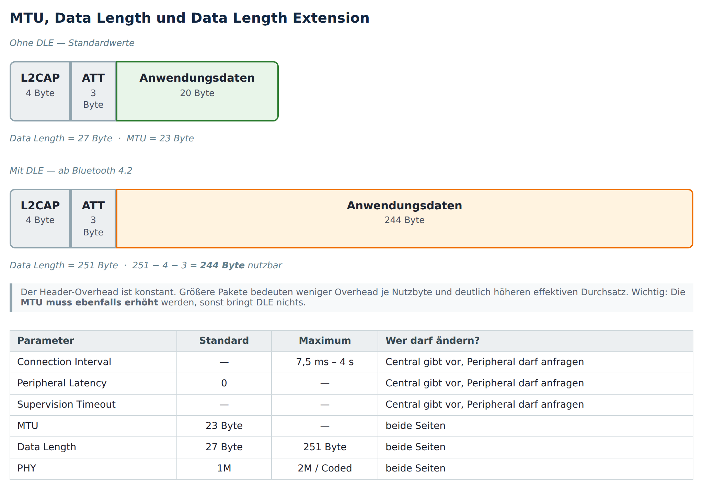

*Abb.: MTU, Data Length und Data Length Extension*

**Standard-PHY**
1M PHY (1 Mbit/s), sofern nicht nach dem Verbindungsaufbau auf 2M oder Coded PHY gewechselt wird.

---

## 8. ATT / GATT – Datenaustausch

**Client-Server-Modell**
ATT arbeitet nach dem Client-Server-Prinzip: der Server hält die Daten, der Client greift darauf zu oder empfängt sie.

**GATT Server**
Gerät, das Daten speichert und dem GATT Client Methoden zum Zugriff darauf bereitstellt.

**GATT Client**
Gerät, das über definierte GATT-Operationen auf die Daten des GATT Servers zugreift.

**Rollenunabhängigkeit**
Die GATT-Rollen (Client/Server) sind **unabhängig** von den GAP-Rollen (Central/Peripheral). Üblich ist: Peripheral = Server, Central = Client – je nach Anwendung sind aber auch andere Kombinationen möglich, ebenso beide Rollen gleichzeitig.

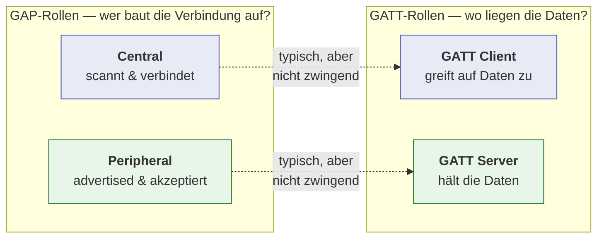
```mermaid
graph LR
    subgraph GAP["GAP-Rollen — wer baut die Verbindung auf?"]
        direction TB
        CEN["<b>Central</b><br/>scannt & verbindet"]
        PER["<b>Peripheral</b><br/>advertised & akzeptiert"]
    end

    subgraph GATT["GATT-Rollen — wo liegen die Daten?"]
        direction TB
        CLI["<b>GATT Client</b><br/>greift auf Daten zu"]
        SRV["<b>GATT Server</b><br/>hält die Daten"]
    end

    CEN -. "typisch, aber<br/>nicht zwingend" .-> CLI
    PER -. "typisch, aber<br/>nicht zwingend" .-> SRV

    style CEN fill:#e8eaf6,stroke:#3f51b5
    style PER fill:#e8f5e9,stroke:#2e7d32
    style CLI fill:#e8eaf6,stroke:#3f51b5
    style SRV fill:#e8f5e9,stroke:#2e7d32
```

**Profile**
Ein oder mehrere Services, die gemeinsam einen Anwendungsfall abdecken. Der Bluetooth SIG pflegt offizielle GATT-Profile; Hersteller dürfen für nicht standardisierte Anwendungsfälle eigene (vendor-specific) Profile definieren.

**Service Discovery**
Vorgang, bei dem der Client vor jeder Interaktion beim Server erfragt, welche Attribute (Services, Characteristics, Handles) vorhanden sind. Muss vor allen GATT-Operationen erfolgen.

### GATT-Operationen

**Client-initiiert:**

* **Read** – Der Client sendet einen Read Request; der Server antwortet mit dem Attributwert.
* **Write** – Der Client sendet einen Write Request mit Daten im Format des Zielattributs. Akzeptiert der Server, quittiert er den Schreibvorgang.
* **Write Without Response** – Schreiben ohne Wartezeit auf eine Quittung. Unquittierte Operation für schnellen Datenaustausch.

**Server-initiiert** (erfordern Freischaltung durch den Client über die CCCD):

* **Notify (Notification)** – Der Server schiebt einen Attributwert aktiv zum Client. **Keine Quittung** durch den Client → schnell und effizient.
* **Indicate (Indication)** – Wie Notify, aber der Client muss quittieren. Deshalb ist nur **eine Indication pro Connection Interval** möglich → langsamer als Notifications, dafür bestätigt.

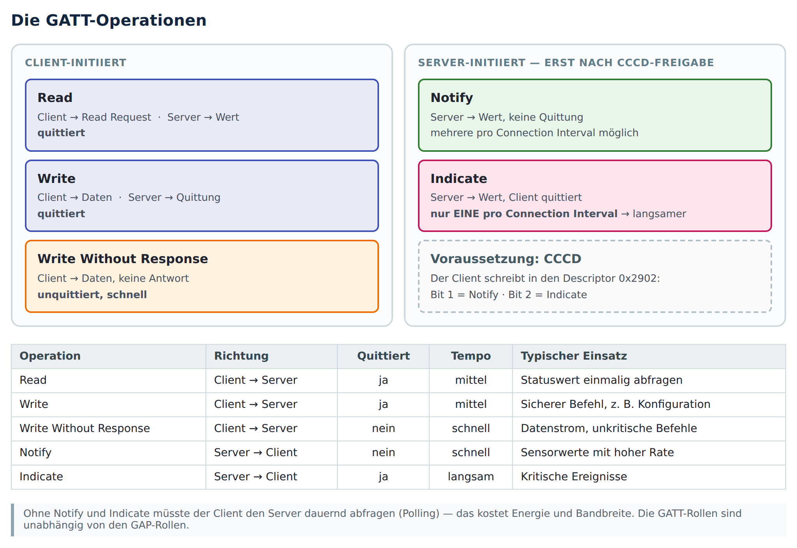

*Abb.: Die GATT-Operationen: Read, Write, Notify, Indicate*

| Operation | Richtung | Quittiert | Tempo | Typischer Einsatz |
|-----------|----------|:---------:|-------|-------------------|
| Read | Client → Server | ja | mittel | Statuswert einmalig abfragen |
| Write | Client → Server | ja | mittel | Sicherer Befehl (z. B. Konfiguration) |
| Write Without Response | Client → Server | nein | schnell | Datenstrom, unkritische Befehle |
| Notify | Server → Client | nein | schnell | Sensorwerte, hohe Rate |
| Indicate | Server → Client | ja | langsam | Kritische Ereignisse, Zustellung muss sicher sein |

**Warum server-initiierte Operationen?**
Ohne Notify/Indicate müsste der Client den Server ständig abfragen (Polling), was Energie und Bandbreite verschwendet.

---

## 9. Attribute, Services und Characteristics

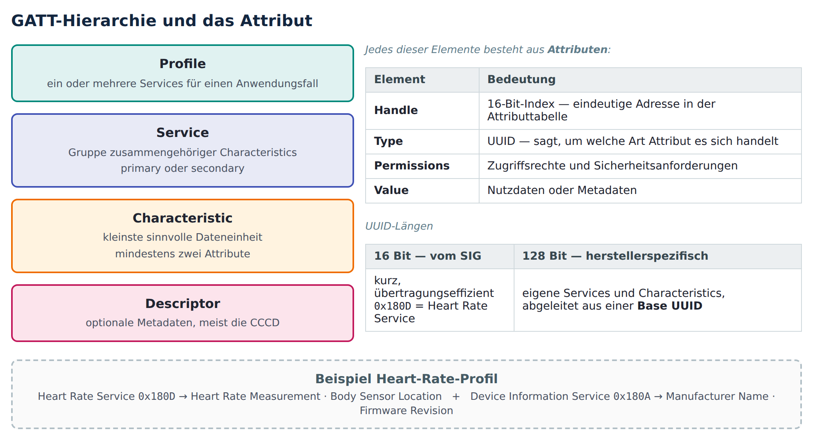

*Abb.: GATT-Hierarchie und der Aufbau eines Attributs*

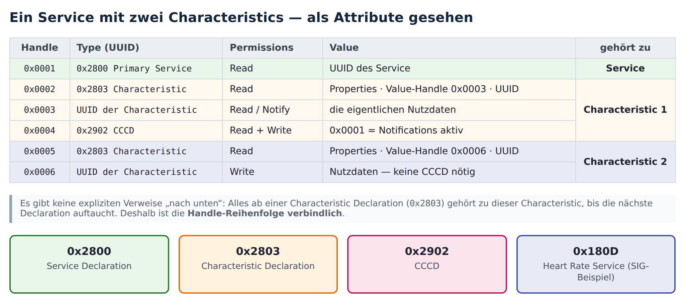

*Abb.: Ein Service mit zwei Characteristics — als Attribute gesehen*

**Attribut (Attribute)**
Standardisiertes Datenformat des ATT-Protokolls, bestehend aus vier Elementen:

| Element | Bedeutung |
|---------|-----------|
| **Handle** | 16-Bit-Index, eindeutige Adresse des Attributs in der Attributtabelle |
| **Type** | UUID, die angibt, um welche Art von Attribut es sich handelt |
| **Permissions** | Zugriffs- und Sicherheitsanforderungen (Lesen/Schreiben, Authentifizierung, Verschlüsselung) |
| **Value** | Nutzdaten oder Metadaten |

**Attributtabelle (Attribute Table)**
Geordnete Liste aller Attribute eines GATT Servers. Die Zugehörigkeit von Attributen zu einer Characteristic ergibt sich aus der **Reihenfolge der Handles**: Alles unterhalb einer Characteristic Declaration gehört zu dieser Characteristic, bis die nächste Declaration (UUID `0x2803`) auftritt.

**UUID (Universally Unique Identifier)**
Bezeichner für Attributtypen. Zwei Formen:
* **16-Bit-UUID** – vom Bluetooth SIG vergeben, kurz und damit übertragungseffizient (Beispiel: Heart Rate Service = `0x180D`).
* **128-Bit-UUID** – herstellerspezifisch (vendor-specific) für eigene Services und Characteristics.

**Base UUID**
128-Bit-Grundmuster eines eigenen Profils, in dem vier Byte-Positionen variabel bleiben. Darin werden die eigenen 16-Bit-Kennungen eingesetzt, sodass alle Attribute eines Herstellerprofils dieselbe Basis teilen.

**Service**
Gruppe zusammengehöriger Characteristics. Man unterscheidet **Primary Services** (eigenständige Funktion, direkt auffindbar) und **Secondary Services** (nur zur Einbindung in andere Services).

**Service Declaration Attribute**
Erstes Attribut jedes Service:
* Type: **`0x2800`** (Primary Service)
* Value: die UUID des deklarierten Service
* Permissions: nur lesbar, keine Authentifizierung nötig

**Characteristic**
Kleinste sinnvolle Dateneinheit eines Service, bestehend aus **mindestens zwei** Attributen (optional weiteren).

**Characteristic Definition**
Die Gesamtheit der Attribute, die eine Characteristic ausmachen: Declaration, Value und optional ein oder mehrere Descriptors. Alle drei sind ganz normale Attribute mit denselben vier Feldern – der Unterschied liegt allein darin, was in diesen Feldern steht.

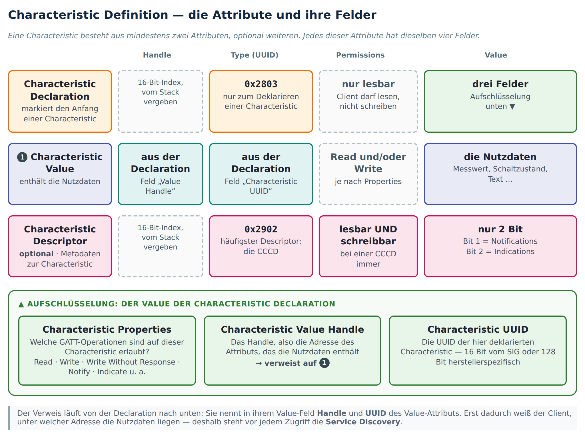

*Abb.: Characteristic Definition — die drei Attribute und die Aufschlüsselung des Declaration-Value*

**Characteristic Declaration Attribute**
Markiert den Anfang einer Characteristic in der Folge der Characteristics einer Service Definition.

| Feld | Inhalt |
|------|--------|
| **Handle** | 16-Bit-Index, vom Stack vergeben |
| **Type** | **`0x2803`** – diese UUID dient ausschließlich dazu, eine Characteristic zu deklarieren |
| **Permissions** | **nur lesbar** – Clients können den Wert lesen, aber nicht überschreiben |
| **Value** | drei Felder, siehe unten |

Die drei Felder im **Value** der Declaration:

* **Characteristic Properties** – welche GATT-Operationen auf dieser Characteristic zulässig sind (Read, Write, Write Without Response, Notify, Indicate u. a.)
* **Characteristic Value Handle** – das Handle, also die Adresse des Attributs, das die Nutzdaten enthält, mithin ein Verweis auf das Characteristic Value Attribute
* **Characteristic UUID** – die UUID der hier deklarierten Characteristic

**Characteristic Value Attribute**
Hier stehen die eigentlichen Nutzdaten. **Handle und Type sind genau die, auf die das Value-Feld der Declaration verweist.** Die Permissions legen fest, ob der Client lesen und/oder schreiben darf.

**Characteristic Properties**
Bitfeld im Value der Declaration, das festlegt, welche Operationen auf der Characteristic zulässig sind: Read, Write, Write Without Response, Notify, Indicate u. a.

**Descriptor (Characteristic Descriptor Attribute)**
**Optionales** Zusatzattribut mit Metadaten zu einer Characteristic – es gibt dem Client zusätzliche Auskunft über deren Beschaffenheit (z. B. Beschreibung, Einheit, Konfiguration).

**CCCD (Client Characteristic Configuration Descriptor)**
Häufigster Descriptor.
* Type: **`0x2902`**
* Permissions: immer lesbar **und** schreibbar
* Value: Bitfeld – erstes Bit aktiviert **Notifications**, zweites Bit aktiviert **Indications**
* Zwingend erforderlich, damit der Server Notify/Indicate senden darf: Der Client "abonniert" die Characteristic, indem er das entsprechende Bit setzt.
* Nur bei Characteristics vorhanden, die Notify oder Indicate unterstützen. Eine reine Write-Characteristic (z. B. eine LED) hat keine CCCD.

**Beispiel aus dem Kurs (`my_lbs`-Service)**
Ein eigener Service mit drei Characteristics – Button, LED und MySensor – ergibt zusammen **neun Attribute**:

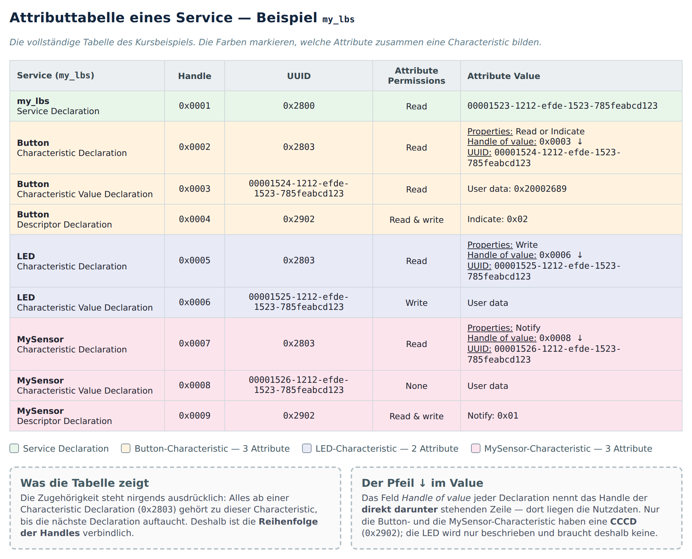

*Abb.: Attributtabelle des Service `my_lbs` — die vollständige Tabelle aus dem Kurs*

Die Werte stammen aus dem Kursbeispiel. Beachtenswert sind drei Stellen:

* Das Feld **Handle of value** jeder Characteristic Declaration nennt das Handle der direkt darunter stehenden Zeile – dort liegen die Nutzdaten.
* Die **LED-Characteristic** kommt mit zwei Attributen aus, weil sie nur beschrieben wird und deshalb keine CCCD braucht. Button und MySensor haben je drei.
* Die Permissions des **MySensor-Value-Attributs** stehen auf `None`: Der Wert wird ausschließlich per Notification ausgeliefert, nicht gelesen.

> **Zugehörigkeit über die Reihenfolge:** Es gibt keine expliziten Verweise „nach unten“.
> Alles ab einer Characteristic Declaration (`0x2803`) gehört zu dieser Characteristic,
> bis die nächste Declaration auftaucht. Deshalb ist die **Handle-Reihenfolge** verbindlich.

**CCCD-Werte**

| Wert | Bedeutung |
|------|-----------|
| `0x0000` | Notifications und Indications aus (Standard) |
| `0x0001` | Notifications aktiviert (Bit 1) |
| `0x0002` | Indications aktiviert (Bit 2) |

---

## 10. Sicherheit: Pairing, Bonding, Verschlüsselung

**Pairing**
Vorgang des Erzeugens, Verteilens und Authentifizierens von Schlüsseln zum Zweck der Verschlüsselung.

**Bonding**
Geht über Pairing hinaus: Die Schlüssel werden **dauerhaft gespeichert** und Identitätsschlüssel ausgetauscht, sodass sich die Geräte bei künftigen Verbindungen wiedererkennen und die Verbindung ohne erneutes Pairing verschlüsseln können. Die Adressen gebondeter Geräte landen häufig in der [Filter Accept List](#6-verbindungen-connections).

**Encryption (Verschlüsselung)**
Schutz der übertragenen Daten vor Mitlesen. Basiert auf dem ausgehandelten LTK.

**Authentication (Authentifizierung)**
Nachweis, dass das Gegenüber tatsächlich das erwartete Gerät ist – Voraussetzung für MITM-Schutz. Verschlüsselung allein ist noch keine Authentifizierung.

**MITM (Man-In-The-Middle)**
Angriff, bei dem sich ein Dritter unbemerkt zwischen zwei Geräte schaltet. Schutz erfordert Security Level 3 oder höher.

**Eavesdropping**
Passives Mitlauschen der Funkübertragung.

### Die drei Phasen des Pairings

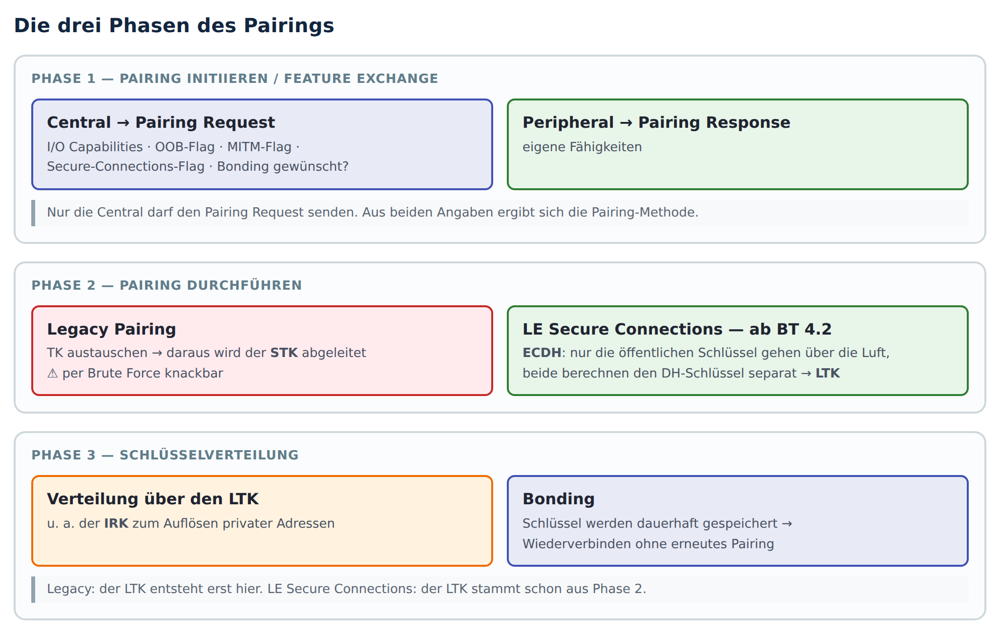

*Abb.: Die drei Phasen des Pairings*

**Phase 1 – Pairing initiieren (Feature Exchange)**
Die Central sendet einen **Pairing Request**, das Peripheral antwortet mit einem **Pairing Response**. Ausgetauscht werden I/O-Capabilities, Sicherheitsmerkmale (OOB-Flag, MITM-Flag, Secure-Connections-Flag) und der Bonding-Wunsch.
Wichtig: **Nur die Central darf einen Pairing Request senden.**

**I/O Capabilities**
Ein- und Ausgabefähigkeiten eines Geräts – bestimmen zusammen mit OOB- und MITM-Flag, welche Pairing-Methode gewählt wird. Fünf Ausprägungen:
* **DisplayOnly** – nur Anzeige
* **DisplayYesNo** – Anzeige plus Ja/Nein-Bestätigung
* **KeyboardOnly** – nur Eingabe
* **NoInputNoOutput** – weder Ein- noch Ausgabe
* **KeyboardDisplay** – Eingabe und Anzeige

**Phase 2 – Pairing durchführen**
Hier entstehen die Schlüssel – bei **beiden** Verfahren. Entscheidend ist dabei: **Der eigentliche Schlüssel geht in keinem der beiden Verfahren über die Luft.** Übertragen werden nur *Hilfswerte*; das Geheimnis berechnet jede Seite daraus für sich.

* **Legacy Pairing:** Der **TK** liegt beiden Seiten bereits vor, ohne gesendet zu werden – bei Just Works ist er schlicht `0`, bei Passkey Entry tippt ihn der Nutzer ein, bei OOB kommt er über den anderen Kanal. Über die Luft gehen nur **Zufallszahlen und Confirm-Werte**. Aus TK und Zufallszahlen berechnet jede Seite den **STK** selbst; der STK wird nie übertragen.
* **LE Secure Connections:** Jedes Gerät erzeugt ein **ECDH**-Schlüsselpaar und sendet seinen **öffentlichen** Schlüssel. Beide berechnen daraus getrennt denselben **DHKey**, der das Gerät nie verlässt, und leiten daraus den **LTK** ab – ebenfalls ohne Übertragung.

Genau das macht das Verfahren sicher: Ein Mitlauscher sieht nur die Hilfswerte, nicht das Geheimnis.

**Phase 3 – Schlüsselverteilung (Key Distribution)**
Die Verbindung ist inzwischen mit dem Schlüssel aus Phase 2 verschlüsselt – STK bei Legacy, LTK bei LESC. Über diese geschützte Verbindung werden die übrigen Schlüssel verteilt. Sie ermöglichen das Wiedererkennen des Peers und das erneute Verschlüsseln beim Wiederverbinden.

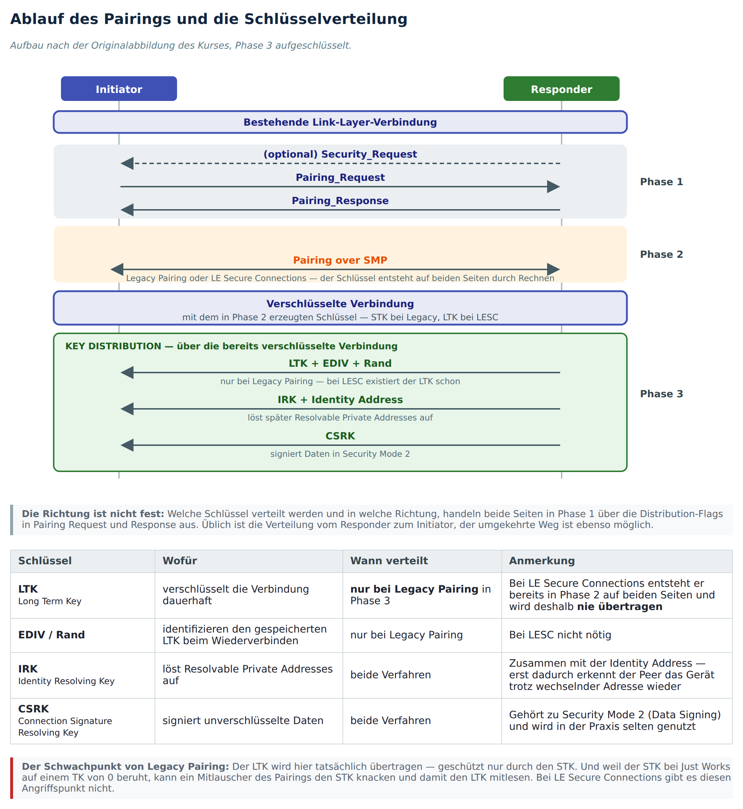

*Abb.: Ablauf des Pairings — Phase 3 mit den verteilten Schlüsseln*

Der Unterschied zwischen den beiden Verfahren liegt genau hier:

* Bei **LE Secure Connections** ist der LTK am Ende von Phase 2 fertig. Phase 3 verteilt nur noch IRK und CSRK – der LTK selbst wird **nie übertragen**.
* Bei **Legacy Pairing** entsteht in Phase 2 nur der kurzlebige STK. Der **LTK wird in Phase 3 tatsächlich verschickt**, geschützt allein durch den STK. Und weil der STK bei Just Works auf einem TK von `0` beruht, ist das die Schwachstelle des Verfahrens: Wer das Pairing mitschneidet, knackt den STK und liest damit den LTK mit.

Welche Schlüssel verteilt werden und in welche Richtung, handeln beide Seiten in Phase 1 über die **Distribution-Flags** in Pairing Request und Response aus.

### Schlüsselarten

**TK (Temporary Key)**
Temporärer Schlüssel im Legacy Pairing. Bei Just Works ist er **0**; bei Passkey Entry eine 6-stellige Zahl; bei OOB bis zu 128 Bit.

**STK (Short Term Key)**
Aus dem TK abgeleiteter Kurzzeitschlüssel des Legacy Pairings. Gilt als **leicht zu knacken**.

**LTK (Long Term Key)**
Langzeitschlüssel zur Verschlüsselung der Verbindung. Bei LE Secure Connections direkt aus dem Diffie-Hellman-Schlüssel und Authentifizierungsdaten erzeugt und praktisch nicht zu brechen.

**IRK (Identity Resolving Key)**
Siehe [Abschnitt 5](#5-bluetooth-adressen) – dient dem Auflösen von Resolvable Private Addresses. Wird in Phase 3 zusammen mit der **Identity Address** verteilt.

**CSRK (Connection Signature Resolving Key)**
Schlüssel zum **Signieren** unverschlüsselter Daten. Gehört zu Security Mode 2 (Data Signing) und wird in der Praxis selten genutzt. Wird ebenfalls in Phase 3 verteilt.

**EDIV und Rand**
Zwei Werte, die bei **Legacy Pairing** zusammen mit dem LTK verteilt werden. Sie identifizieren beim Wiederverbinden den gespeicherten LTK. Bei LE Secure Connections werden sie nicht benötigt.

### Pairing-Methoden (Association Models)

| Methode                | Prinzip                                                                               | Authen-tifiziert | MITM-Schutz | Anmerkung                                                                                                                                                                                                                                                                                       |
| ---------------------- | ------------------------------------------------------------------------------------- | :--------------: | :---------: | ----------------------------------------------------------------------------------------------------------------------------------------------------------------------------------------------------------------------------------------------------------------------------------------------- |
| **Just Works**         | Kein Benutzereingriff; Schlüssel aus offen übertragenen Informationen                 |       Nein       |    Nein     | Kein Schutz gegen Eavesdropping oder MITM (Legacy: TK = 0)                                                                                                                                                                                                                                      |
| **Passkey Entry**      | 6-stellige Zahl wird auf einem Gerät angezeigt und auf dem anderen eingegeben         |        Ja        |     Ja      | Legacy: TK kann mitgeschnitten bzw. über alle 999.999 Kombinationen gebrutet werden – der Schutz ist dort nur nominell, weshalb Core 6.2 diese Kombination nicht mehr als Security Level 3 zählt. LESC: Passkey wird mit ECDH-Public-Key und 128-Bit-Zufallszahl kombiniert → deutlich sicherer |
| **Out-of-Band (OOB)**  | Schlüsselaustausch über einen anderen Kanal, z. B. NFC, QR-Code, Kabrel               |        Ja        |     Ja      | Unterstützt 128-Bit-TK; die Stärke des Schutzes hängt vom OOB-Kanal ab. In Legacy Pairing die empfohlene sichere Methode. Bei LESC muss nur **eines** der beiden Geräte das OOB-Flag gesetzt haben                                                                                              |
| **Numeric Comparison** | Beide Geräte zeigen eine 6-stellige Zahl an, der Nutzer bestätigt die Übereinstimmung |        Ja        |     Ja      | **Nur mit LE Secure Connections**; schützt vor MITM durch manuelle Prüfung                                                                                                                                                                                                                      |

> **Warum beide Spalten immer übereinstimmen:** In Bluetooth LE sind *authentifiziert* und *MITM-geschützt* dasselbe Merkmal – eine Methode gilt genau dann als authentifiziert, wenn sie einen Man-In-The-Middle ausschließt. Die Spalten sind hier getrennt aufgeführt, weil beide Begriffe in der Literatur nebeneinander vorkommen.

### Wie die Methode bestimmt wird — zwei Schritte

Welche der vier Methoden zum Einsatz kommt, ergibt sich aus den in Phase 1 ausgetauschten Angaben. Die Auswertung läuft in **zwei aufeinanderfolgenden Schritten**.

**Schritt 1 – die Flags.** Zuerst zählen die **OOB-Flags** beider Seiten. Ist mindestens eines gesetzt, wird OOB verwendet – bei LE Secure Connections genügt dafür eine Seite. Andernfalls geht es weiter zu den **MITM-Flags**: Ist dort mindestens eines gesetzt, entscheiden die I/O Capabilities; ist keines gesetzt, bleibt es bei Just Works.

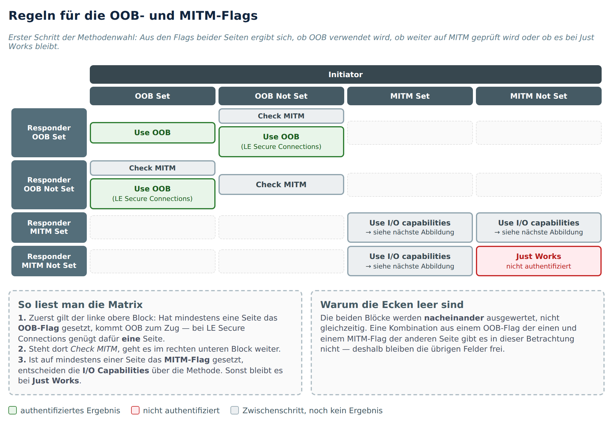

*Abb.: Regeln für die Verwendung der OOB- und MITM-Flags*

**Schritt 2 – die I/O Capabilities.** Steht das Ergebnis aus Schritt 1 auf „Use I/O capabilities", entscheidet die Kombination der Ein- und Ausgabefähigkeiten beider Geräte über die Methode.

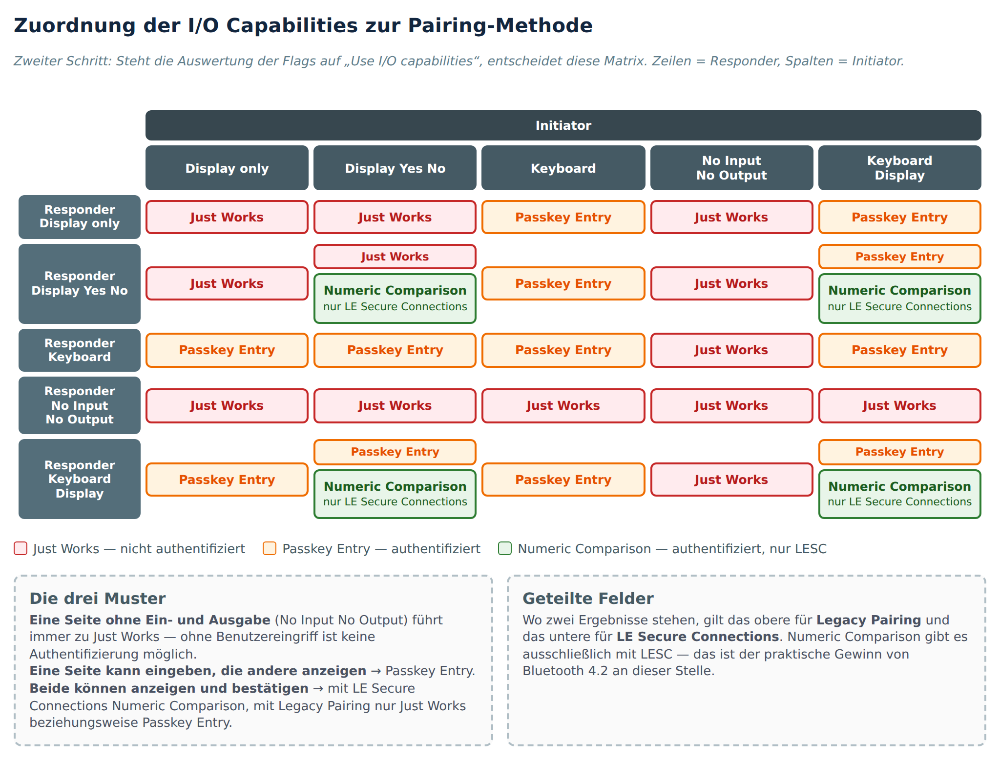

*Abb.: Zuordnung der I/O Capabilities zur Methode der Schlüsselerzeugung*

Drei Muster prägen diese Matrix:

* **No Input No Output** auf einer der beiden Seiten führt immer zu **Just Works** – ohne Benutzereingriff ist keine Authentifizierung möglich.
* Kann eine Seite **eingeben** und die andere **anzeigen**, ergibt sich **Passkey Entry**.
* Können **beide anzeigen und bestätigen** (DisplayYesNo oder KeyboardDisplay), ergibt sich mit LE Secure Connections **Numeric Comparison** – mit Legacy Pairing dagegen nur Just Works beziehungsweise Passkey Entry.

In den geteilten Feldern der Matrix gilt das obere Ergebnis für **Legacy Pairing**, das untere für **LE Secure Connections**.

### Legacy Pairing vs. LE Secure Connections

**Legacy Pairing** (vor Bluetooth 4.2)
Nutzt TK und STK. Der STK ist per Brute Force leicht zu knacken; wenig Schlüsselmaterial, schwache Authentifizierung. Anfällig für Eavesdropping.

**LE Secure Connections (LESC)** (ab Bluetooth **4.2**)
Verwendet **ECDH (Elliptic-Curve Diffie-Hellman)** zur Erzeugung eines Public-Private-Schlüsselpaares. Über die Luft werden **ausschließlich die öffentlichen Schlüssel** ausgetauscht; der gemeinsame Diffie-Hellman-Schlüssel wird auf beiden Seiten getrennt berechnet und mit Authentifizierungsdaten zum LTK verrechnet. Das Knacken des LTK ist dadurch extrem schwierig.

**Warum beides unterstützen?**
Aus Interoperabilitätsgründen: ältere Geräte beherrschen kein LESC.

---

## 11. Security Modes und Levels

**Security Mode 1** – Sicherheit über Verschlüsselung. Vier Level:

| Level | Bezeichnung                         | Bedeutung                                                                                                                                                          |
| :---: | ----------------------------------- | ------------------------------------------------------------------------------------------------------------------------------------------------------------------ |
| **1** | No Security                         | Klartext – weder Authentifizierung noch Verschlüsselung                                                                                                            |
| **2** | Unauthenticated Encryption          | Verschlüsselt, aber nicht authentifiziert. Erreicht mit Legacy Pairing (Just Works oder Passkey Entry) oder LESC mit Just Works. **Kein MITM-Schutz**              |
| **3** | Authenticated Encryption (Legacy)   | Authentifiziert und verschlüsselt mit Legacy Pairing. Erfordert die **OOB**-Methode. *(Bis Core 6.2 zählte auch Passkey Entry dazu; das wurde mit v6.2 entfernt.)* |
| **4** | Authenticated LE Secure Connections | Höchstes Level. Nur wenn **beide** Geräte LESC unterstützen **und** Passkey Entry, Numeric Comparison oder OOB verwendet wird                                      |

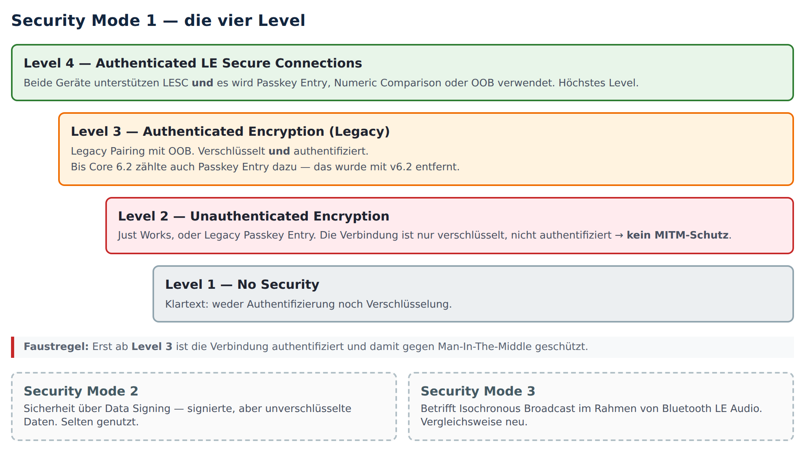

*Abb.: Security Mode 1: die vier Level*

**Faustregel MITM-Schutz:** Erst ab **Level 3** ist die Verbindung authentifiziert und damit gegen Man-In-The-Middle geschützt.

**Security Mode 2** – Sicherheit über **Data Signing** (signierte, aber unverschlüsselte Daten). In der Praxis selten genutzt.

**Security Mode 3** – Betrifft **Isochronous Broadcast** im Rahmen von Bluetooth LE Audio; vergleichsweise neu.

---

## 12. Sniffing und Debugging

**Sniffing**
Abfangen und Anzeigen von BLE-Paketen während der Übertragung, um in nahezu Echtzeit detaillierte Informationen über jedes zwischen zwei Geräten ausgetauschte Paket zu erhalten – auch bei verschlüsselten Verbindungen (wenn die Schlüssel bzw. der Pairing-Vorgang mitgeschnitten wurden).

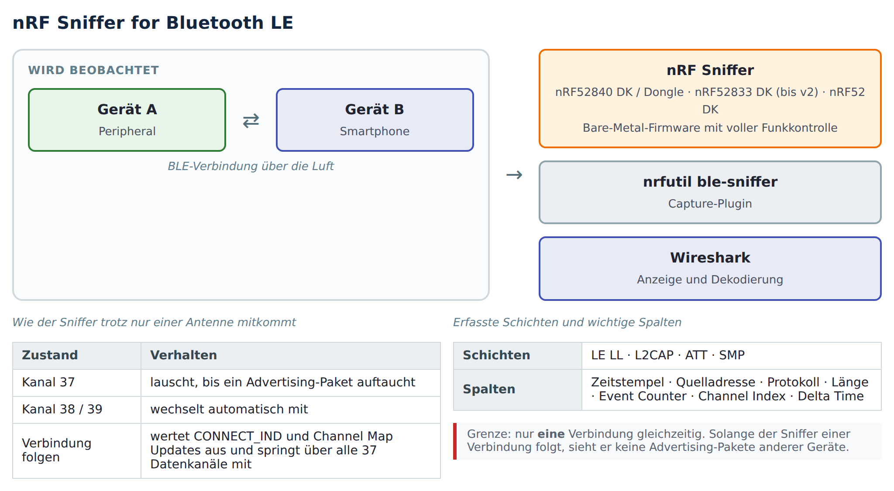

*Abb.: Aufbau eines Sniffer-Setups mit nRF Sniffer und Wireshark*

*Wie der Sniffer trotz nur einer Antenne mitkommt:*

**nRF Sniffer for Bluetooth LE**
Nordic-Werkzeug: eine Firmware, die "bare metal" (ohne Betriebssystem) auf einem BLE-Gerät im Funkbereich läuft und volle Kontrolle über den Funkteil hat, um Pakete mitzulesen. Unterstützte Hardware u. a.: **nRF52840 DK, nRF52840 Dongle, nRF52833 DK** (v2 und älter; v3 nicht kompatibel), **nRF52 DK**. Nutzbar nur über dedizierte nRF-USB-Ports.

**Wireshark**
Quelloffener Netzwerk-Paketanalysator; benötigt für BLE ein externes Capture-Plugin (den nRF Sniffer), um die mitgeschnittenen Pakete darzustellen und zu dekodieren.

**nRF Util (nrfutil)**
Kommandozeilenwerkzeug mit den Befehlen `ble-sniffer` und `device` – zum Flashen der Sniffer-Firmware und als Bindeglied zu Wireshark.

**Kanalverfolgung beim Advertising**
Da der Sniffer nur eine Antenne hat, lauscht er zunächst auf Kanal **37** und wechselt bei erkanntem Paket automatisch auf **38** und **39**.

**Verfolgen einer Verbindung (Connection Following)**
Das Channel Hopping einer bestehenden Verbindung lässt sich nachvollziehen, indem der Sniffer den **Connection Request** und die **Channel Map Updates** auswertet. Er folgt dann den Sprüngen über bis zu 37 Kanäle.

**Grenzen des Sniffers**
Nur **eine** Verbindung gleichzeitig beobachtbar (eine Antenne). Während er einer Verbindung folgt, kann er keine Advertising-Pakete anderer Geräte mitschneiden.

**Erfasste Protokollschichten**
LE LL (Link Layer), L2CAP (Verbindungsparameter), ATT (GATT-Operationen), SMP (Pairing/Verschlüsselung).

**Wichtige Wireshark-Spalten**
Zeitstempel, Quelladresse, Protokollschicht, Paketlänge, **Event Counter**, **Channel Index** und **Delta Time (Start-to-Start)** – der zeitliche Abstand zwischen aufeinanderfolgenden Paketen.

---

## 13. Kennzahlen-Übersicht

| Größe | Wert |
|-------|------|
| Frequenzband | 2400–2483,5 MHz |
| Kanalbandbreite | 2 MHz |
| HF-Kanäle gesamt | 40 |
| Advertising-Kanäle | 37, 38, 39 |
| Datenkanäle | 0–36 (37 Stück) |
| Max. Sendeleistung | 20 dBm (0,1 W) |
| Datenraten | 1 Mbit/s (1M), 2 Mbit/s (2M), 500 kbit/s (S=2), 125 kbit/s (S=8) |
| Max. Anwendungsdurchsatz | ca. 1,4 Mbit/s |
| Max. Reichweite | ca. 1000 m (bei 125/500 kbit/s) |
| Advertising Interval | 20 ms – 10,24 s, Schritt 0,625 ms |
| Advertising Random Delay | 0 – 10 ms |
| Scan Interval / Scan Window | 2,5 ms – 10,24 s, Schritt 0,625 ms |
| Bluetooth-Adresse | 48 Bit (6 Byte) |
| Paket-Nutzlast | 27 – 251 Byte |
| Default MTU (ATT_MTU) | 23 Byte |
| Default Data Length | 27 Byte |
| Max. Data Length (mit DLE) | 251 Byte |
| Max. Anwendungsdaten je Paket | 244 Byte (251 − 4 L2CAP − 3 ATT) |
| L2CAP-Header | 4 Byte |
| Attribut-Header (ATT) | 3 Byte |
| Attribut-Handle | 16 Bit |
| UUID-Längen | 16 Bit (SIG) oder 128 Bit (vendor-specific) |
| Passkey | 6 Stellen (999.999 Kombinationen) |

**Wichtige SIG-UUIDs aus dem Kurs**

| UUID | Bedeutung |
|------|-----------|
| `0x2800` | Primary Service Declaration |
| `0x2803` | Characteristic Declaration |
| `0x2902` | Client Characteristic Configuration Descriptor (CCCD) |
| `0x180D` | Heart Rate Service (Beispiel für einen SIG-Service) |

---

## 14. Abkürzungsverzeichnis

| Abkürzung | Ausgeschrieben | Bedeutung in Kürze |
|-----------|----------------|--------------------|
| **AD** | Advertising Data | Datenstruktur im Advertising-Paket |
| **ADV** | Advertising | Aussenden von Advertising-Paketen |
| **ATT** | Attribute Protocol | Protokoll zum Bereitstellen/Abrufen von Attributen |
| **BLE** | Bluetooth Low Energy | Energiesparender Bluetooth-Funkstandard |
| **BR/EDR** | Basic Rate / Enhanced Data Rate | Bluetooth Classic |
| **CCCD** | Client Characteristic Configuration Descriptor | Schaltet Notify/Indicate frei (`0x2902`) |
| **ChSel** | Channel Selection | Header-Bit für Channel Selection Algorithm #2 |
| **CRC** | Cyclic Redundancy Check | Prüfsumme im Paket |
| **CSRK** | Connection Signature Resolving Key | Signiert Daten in Security Mode 2 |
| **DHKey** | Diffie-Hellman Key | Bei LESC auf beiden Seiten getrennt berechnet, nie übertragen |
| **DK** | Development Kit | Entwicklungsboard |
| **EDIV / Rand** | Encrypted Diversifier / Random Number | Identifizieren den gespeicherten LTK (nur Legacy) |
| **DLE** | Data Length Extension | Erweiterung der Nutzlast auf bis zu 251 Byte |
| **ECDH** | Elliptic-Curve Diffie-Hellman | Schlüsselaustauschverfahren bei LESC |
| **GAP** | Generic Access Profile | Rollen, Discovery, Verbindungsaufbau |
| **GATT** | Generic Attribute Profile | Datenhierarchie und -operationen |
| **HCI** | Host Controller Interface | Schnittstelle Host ↔ Controller |
| **IRK** | Identity Resolving Key | Löst Resolvable Private Addresses auf — auch für die Filter Accept List nötig |
| **ISM** | Industrial, Scientific, Medical | Lizenzfreies Frequenzband (2,4 GHz) |
| **L2CAP** | Logical Link Control and Adaptation Protocol | Kapselung/Multiplexing, 4-Byte-Header |
| **LESC** | LE Secure Connections | Sicheres Pairing ab Bluetooth 4.2 |
| **LL** | Link Layer | Steuert Funkzustände und Timing |
| **LTK** | Long Term Key | Langzeit-Verschlüsselungsschlüssel |
| **MITM** | Man-In-The-Middle | Angreifer zwischen zwei Geräten |
| **MTU** | Maximum Transmission Unit | Max. ATT-Paketgröße, Standard 23 Byte |
| **OOB** | Out-of-Band | Schlüsselaustausch über anderen Kanal (z. B. NFC) |
| **PAwR** | Periodic Advertising with Responses | Bidirektional ohne Verbindung (BT 5.4) |
| **PDU** | Protocol Data Unit | Nutzdateneinheit eines Pakets |
| **PHY** | Physical Layer | Physikalische Funkschicht |
| **RFU** | Reserved for Future Use | Reserviertes Header-Feld |
| **RPA** | Resolvable Private Address | Wechselnde, auflösbare Adresse |
| **RxAdd / TxAdd** | Receiver / Transmitter Address type | Header-Bit: public oder random |
| **SIG** | Special Interest Group | Bluetooth-Normungsgremium |
| **SMP** | Security Manager Protocol | Pairing, Schlüssel, Verschlüsselung |
| **STK** | Short Term Key | Kurzzeitschlüssel im Legacy Pairing |
| **TK** | Temporary Key | Temporärer Schlüssel im Legacy Pairing |
| **UUID** | Universally Unique Identifier | Typkennung von Attributen |

---

*Erstellt aus den Theorie-Themen der Lektionen 1–6 des Kurses "Bluetooth Low Energy Fundamentals" (Nordic Developer Academy). Übungen (Exercises) wurden vereinbarungsgemäß nicht berücksichtigt. Kursiv bzw. mit Klammern gekennzeichnete Wertebereiche stammen ergänzend aus der Bluetooth Core Specification.*
