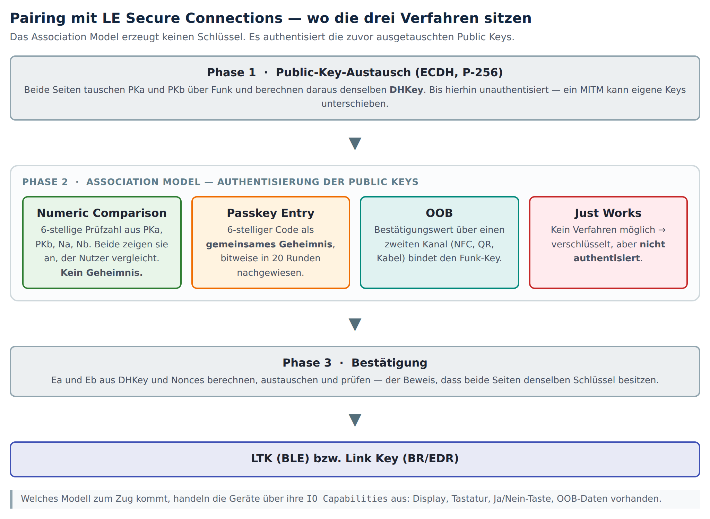
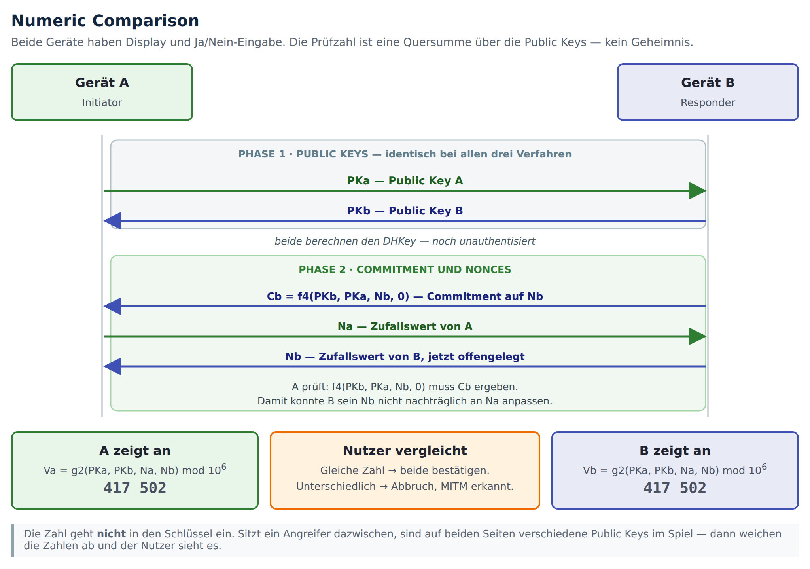
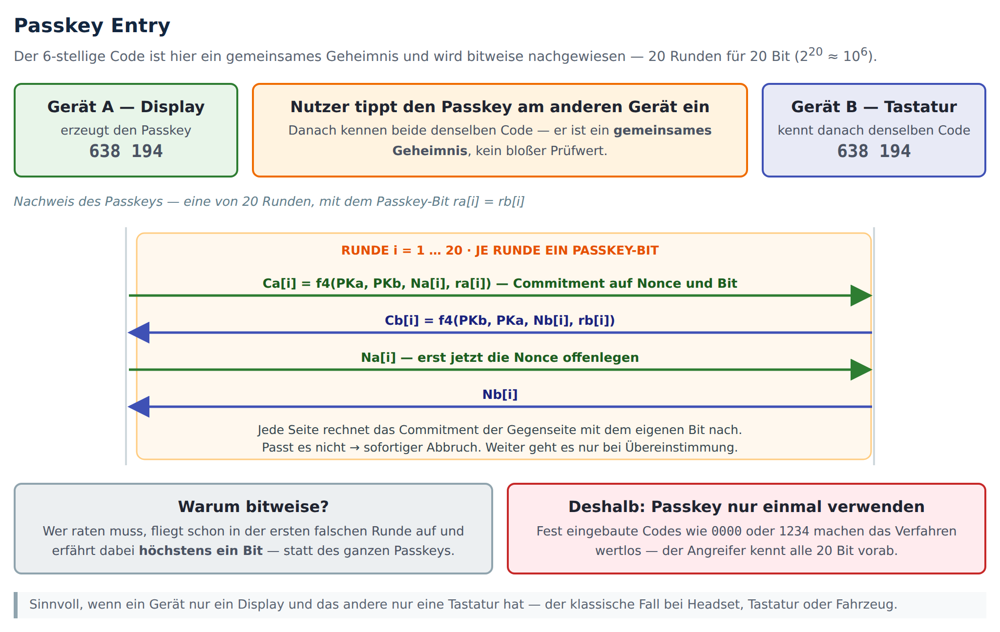
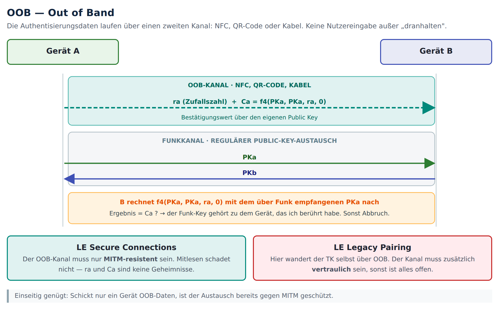
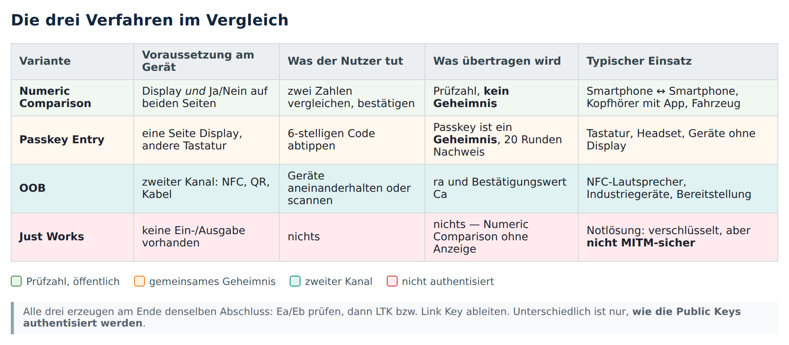

# Wie zwei Geräte sich beim Pairing gegenseitig erkennen

## Das Problem, das gelöst werden muss

Zwei Geräte, die sich noch nie begegnet sind, wollen einen gemeinsamen geheimen Schlüssel haben. Sie können dafür nur über Funk miteinander reden, und jeder in der Umgebung hört mit.

Für das reine Mithören gibt es seit Langem eine Lösung: das Diffie-Hellman-Verfahren, bei Bluetooth in der Variante ECDH auf der Kurve P-256. Beide Geräte schicken sich einen öffentlichen Schlüssel zu, und jedes rechnet aus dem eigenen privaten und dem fremden öffentlichen Schlüssel dasselbe Ergebnis aus. Dieses Ergebnis heißt DHKey. Wer nur mithört, kann es nicht nachrechnen, obwohl er beide öffentlichen Schlüssel gesehen hat. Das ist die eigentliche Mathematik hinter dem Pairing, und sie funktioniert.

Sie hat aber eine Lücke, und die ist entscheidend: Ein Angreifer, der nicht nur zuhört, sondern sich aktiv dazwischenschaltet, kann beide Seiten täuschen. Er fängt den öffentlichen Schlüssel von A ab und schickt B stattdessen seinen eigenen. Umgekehrt genauso. Danach führt er zwei getrennte, jeweils sauber verschlüsselte Gespräche und reicht die Nachrichten durch. Beide Geräte sind überzeugt, mit dem richtigen Gegenüber zu sprechen. Das ist der klassische Man-in-the-Middle-Angriff.

Der springende Punkt: **Aus dem Funkverkehr allein lässt sich das nicht auflösen.** Ein Gerät kann nicht wissen, ob der öffentliche Schlüssel, den es empfangen hat, wirklich vom gewünschten Partner stammt. Es braucht etwas, das der Angreifer nicht kontrolliert. Genau dafür sind die drei Verfahren da, die diesem Kapitel den Namen geben. Sie heißen im Standard *Association Models*.

Wichtig zum Verständnis: **Diese Verfahren erzeugen keinen Schlüssel.** Der Schlüssel kommt aus dem ECDH-Teil. Die Association Models beantworten nur die eine Frage: Gehört der öffentliche Schlüssel, den ich empfangen habe, wirklich zum richtigen Gerät?

*Abb. 1: Die drei Verfahren sitzen in der Mitte des Ablaufs. Davor der Schlüsselaustausch, danach die Bestätigung und die Ableitung des eigentlichen Schlüssels.*

Welches der Verfahren zum Einsatz kommt, handeln die Geräte selbst aus. Grundlage sind ihre *IO Capabilities*: Hat das Gerät ein Display? Eine Tastatur? Wenigstens eine Ja/Nein-Taste? Liegen OOB-Daten vor? Ein Kopfhörer ohne Bildschirm hat andere Möglichkeiten als ein Smartphone, und daraus ergibt sich, welches Verfahren überhaupt möglich ist.

---

## Numeric Comparison: der Mensch vergleicht zwei Zahlen

Dieses Verfahren setzt voraus, dass beide Geräte etwas anzeigen können und beide eine Ja/Nein-Bestätigung entgegennehmen. Der typische Fall sind zwei Smartphones oder ein Handy und ein Auto.

Die Idee lässt sich in einem Satz sagen: Beide Geräte rechnen aus dem, was sie voneinander empfangen haben, eine sechsstellige Zahl aus und zeigen sie an. Stimmen die Zahlen überein, war kein Angreifer im Spiel.

Warum das funktioniert: Die Zahl ist eine Art Fingerabdruck der beiden öffentlichen Schlüssel. Sitzt ein Angreifer dazwischen, sieht Gerät A den Schlüssel des Angreifers und Gerät B ebenfalls den des Angreifers, aber es sind zwei verschiedene. Damit gehen zwei verschiedene Fingerabdrücke in die Rechnung ein, und auf den Displays stehen unterschiedliche Zahlen. Der Mensch bemerkt es und bricht ab. Der Funkkanal kann das nicht leisten, das Augenpaar davor schon.

*Abb. 2: Numeric Comparison. Vor der Prüfzahl steht ein Commitment, damit keine Seite ihren Zufallswert nachträglich anpassen kann.*

In der Abbildung fällt ein Schritt auf, der auf den ersten Blick überflüssig wirkt: Bevor die beiden Zufallswerte Na und Nb ausgetauscht werden, schickt B einen Wert namens Cb. Das ist ein sogenanntes **Commitment**, und es ist leichter zu verstehen, wenn man es sich als versiegelten Umschlag vorstellt.

B legt seinen Zufallswert in einen Umschlag und übergibt den zugeklebten Umschlag. A kann nicht hineinsehen. Erst danach nennt A seinen eigenen Zufallswert, und erst dann öffnet B den Umschlag. A prüft, dass darin wirklich der Wert steckt, der vorher versiegelt wurde.

Ohne diesen Schritt könnte ein Angreifer zuerst abwarten, welchen Zufallswert die Gegenseite nennt, und dann seinen eigenen so wählen, dass am Ende zufällig die gewünschte Zahl herauskommt. Der Umschlag verhindert das: Wer sich festgelegt hat, kann sich nicht mehr umentscheiden.

Zwei Dinge sind hier oft missverstanden:

- Die sechsstellige Zahl ist **kein Geheimnis**. Sie darf mitgelesen werden, das schadet nichts. Sie soll nur verglichen werden.
- Sie geht **nicht in den Schlüssel ein**. Der Schlüssel steht schon fest, bevor die Zahl überhaupt angezeigt wird.

---

## Passkey Entry: der Mensch trägt ein Geheimnis von einem Gerät zum anderen

Hier ist die Ausgangslage anders. Ein Gerät kann etwas anzeigen, das andere hat eine Tastatur, aber kein Display. Eine Bluetooth-Tastatur ist das Standardbeispiel, ebenso ein Headset oder ein Gerät, das nur eine Zahleneingabe kennt.

Ein Gerät zeigt eine zufällige sechsstellige Zahl an, der Mensch tippt sie am anderen ein. Manchmal läuft es auch andersherum: Der Nutzer denkt sich eine Zahl aus und gibt sie an beiden Geräten ein.

Der entscheidende Unterschied zu Numeric Comparison: Diese Zahl ist ein **echtes Geheimnis**. Sie wird nicht verglichen, sondern beide Seiten müssen beweisen, dass sie dieselbe Zahl kennen. Und dieser Beweis muss geführt werden, ohne die Zahl über Funk zu schicken, denn dann wüsste sie jeder.

*Abb. 3: Passkey Entry. Der Passkey wird in 20 Runden bitweise nachgewiesen, in jeder Runde genau ein Bit.*

Die Lösung ist der Grund, warum dieses Verfahren so aufwendig aussieht: Der Passkey wird **Bit für Bit** nachgewiesen. Sechs Dezimalstellen entsprechen ungefähr 20 Bit, also gibt es 20 Runden. In jeder Runde legen sich beide Seiten wieder per Umschlag auf einen frischen Zufallswert und auf genau ein Bit des Passkeys fest, öffnen die Umschläge und prüfen, ob die andere Seite dasselbe Bit hatte. Passt es nicht, ist sofort Schluss.

Warum dieser Aufwand? Wenn ein Angreifer raten will, fliegt er schon in der ersten Runde auf, in der er falsch liegt. Er lernt dabei höchstens ein einziges Bit. Würde man den Passkey stattdessen in einem Stück prüfen, könnte ein Angreifer die Verbindung immer wieder aufbauen und den Code Stück für Stück eingrenzen.

Daraus folgt die wichtigste Praxisregel dieses Kapitels:

> **Ein Passkey darf nur ein einziges Mal verwendet werden.**
> Der Schutz beruht darauf, dass der Angreifer pro Versuch nur ein Bit erfährt. Wenn er den Code bereits kennt, ist das ganze Verfahren wirkungslos. Fest eingebaute Codes wie `0000` oder `1234`, wie man sie bei billigen Geräten findet, machen Passkey Entry zu einer reinen Formalität ohne Sicherheitsgewinn.

---

## OOB: die Bestätigung nimmt einen anderen Weg

OOB steht für *Out of Band*, also außerhalb des eigentlichen Kanals. Statt den Menschen vergleichen oder tippen zu lassen, benutzt man einen zweiten Übertragungsweg, an den ein Funkangreifer nicht herankommt: NFC, einen aufgedruckten QR-Code oder ein Kabel.

Über diesen zweiten Weg schickt ein Gerät zwei Angaben: eine Zufallszahl und einen Bestätigungswert, der aus dem eigenen öffentlichen Schlüssel berechnet wurde. Die Gegenseite nimmt den öffentlichen Schlüssel, den sie **über Funk** empfangen hat, rechnet den Bestätigungswert damit nach und vergleicht.

Passt es, dann gehört der Funk-Schlüssel zu genau dem Gerät, das man angetippt oder gescannt hat. Ein Angreifer, der über Funk einen anderen Schlüssel untergeschoben hat, scheitert an dieser Probe.

*Abb. 4: OOB. Der zweite Kanal bindet den über Funk empfangenen Schlüssel an das Gerät, das man physisch berührt hat.*

Zwei Punkte dazu:

**Der OOB-Kanal muss nicht geheim sein**, jedenfalls bei LE Secure Connections. Die Zufallszahl und der Bestätigungswert dürfen mitgelesen werden. Wichtig ist nur, dass niemand sie unbemerkt austauschen kann. NFC leistet das über die geringe Reichweite, ein aufgedruckter QR-Code über die physische Anwesenheit.

**Beim alten LE Legacy Pairing ist das anders.** Dort wandert der Schlüssel selbst über den OOB-Kanal. Wer dort mitliest, hat alles. Diese Unterscheidung wird häufig übersehen.

Es genügt übrigens, wenn nur ein Gerät OOB-Daten sendet. Schon eine Richtung reicht, um den Austausch gegen einen Man-in-the-Middle abzusichern.

---

## Just Works: wenn keines der drei Verfahren möglich ist

Manche Geräte haben weder Display noch Tastatur noch NFC. Ein einfacher Sensor zum Beispiel. Dann bleibt nur *Just Works*.

Technisch ist das Numeric Comparison ohne den Vergleichsschritt: Die Prüfzahl wird berechnet, aber niemand sieht sie, und die Bestätigung erfolgt automatisch. Das Ergebnis ist eine verschlüsselte Verbindung, die gegen Mithören schützt, aber **nicht gegen einen Angreifer, der sich dazwischenschaltet**. In der Bluetooth-Terminologie heißt das: die Verbindung ist nicht *authenticated*, sie erreicht keine MITM-Sicherheit.

Just Works ist damit kein viertes gleichwertiges Verfahren, sondern die Notlösung, wenn kein anderes geht.

---

## Zusammenfassung

*Abb. 5: Die Verfahren im Vergleich.*

Alle Verfahren enden gleich. Nachdem die öffentlichen Schlüssel authentisiert sind, tauschen beide Seiten die Bestätigungswerte Ea und Eb aus. Das ist der abschließende Nachweis, dass tatsächlich beide denselben Schlüssel berechnet haben. Erst danach entsteht der eigentliche Langzeitschlüssel, bei BLE der LTK, bei BR/EDR der Link Key.

Die drei Kernaussagen des Kapitels:

1. Der Schlüssel entsteht durch ECDH. Die Association Models authentisieren nur die dabei ausgetauschten öffentlichen Schlüssel.
2. Numeric Comparison arbeitet mit einem öffentlichen Prüfwert, Passkey Entry mit einem echten Geheimnis, OOB mit einem zweiten Übertragungsweg.
3. Ohne eines dieser drei Verfahren gibt es zwar Verschlüsselung, aber keinen Schutz gegen einen Angreifer in der Mitte.
