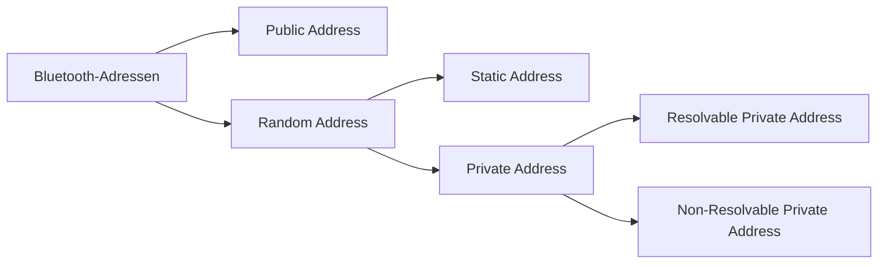

**Bluetooth address** ist eine eindeutige **48-bit address** für jedes Bluetooth LE Gerät.  

  

Wichtige Typen:  

• **Public address**: Vom Hersteller programmiert, bei der **IEEE** registriert, weltweit eindeutig und unveränderlich.  

• **Random static address**: Keine IEEE-Registrierung nötig, kann beim Booten festgelegt werden, bleibt während des Betriebs konstant. Häufigste Variante.  

• **Resolvable random private address**: Wechselt periodisch zum Schutz der Privatsphäre, kann aber über einen **Identity Resolving Key (IRK)** von bekannten Geräten aufgelöst werden.  

• **Non-resolvable random private address**: Wechselt ebenfalls periodisch, kann jedoch von keinem Gerät aufgelöst werden und dient nur dem Tracking-Schutz.  

  
Merke:  
Jedes Bluetooth LE Gerät benötigt mindestens eine **Public address** oder **Random static address**. Private Adressen sind optional und werden für **Privacy** und Tracking-Schutz verwendet. 

